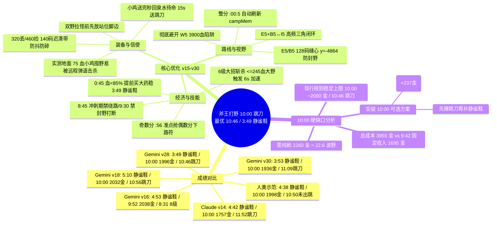

# DotA 6.83d 斧王打野冲刺 10:00 跳刀演进思维导图

```mermaid
mindmap
  root((斧王打野 10:00 跳刀<br/>最优 10:46 / 3:49 静谧鞋))
    成绩对比
      人类示范: 4:38 静谧鞋 / 10:00 1998金 / 10:50未出跳
      Claude v14: 4:42 静谧鞋 / 10:00 1757金 / 11:52跳刀
      Gemini v16: 4:53 静谧鞋 / 9:52 2038金 / 8:31 8级
      Gemini v18: 5:10 静谧鞋 / 10:00 2032金 / 10:56跳刀
      Gemini v28: 3:49 静谧鞋 / 10:00 1996金 / 10:46跳刀
      Gemini v30: 3:53 静谧鞋 / 10:00 1936金 / 11:09跳刀
    核心优化 v15-v30
      路线与视野
        E5+B5↔I5 高频三角闭环
        彻底避开 W5 3900血陷阱
        整分 :00.5 自动刷新 campMem
        E5/B5 128码缝心 y=-4864 防封野
      经济与技能
        0:45 血<85% 提前买大药稳 3:49 静谧鞋
        奇数分 :56 准点抢偶数分下路符
        6级大招斩杀 <=245血大野触发 6s 加速
        8:45 冲刺期禁绕路/9:30 禁封野打断
      装备与信使
        320丢/460捡 140码迟滞带防抖防碎
        双野拉怪前先放站位脚边
        小鸡送完秒回泉水待命 15s 送跳刀
        实测地面 75 血小鸡囤野易被远程弹道击杀
    10:00 硬缺口分析
      总成本 3955 金 vs 9:42 固定收入 1695 金
      需纯刷 2260 金 ≈ 22.6 波野
      现行规则稳定上限 10:00 ~2000 金 / 10:46 跳刀
      突破 10:00 可选方案
        9:30 卖圆盾+补刀斧 (+237金)
        先裸跳刀再补静谧鞋
```
