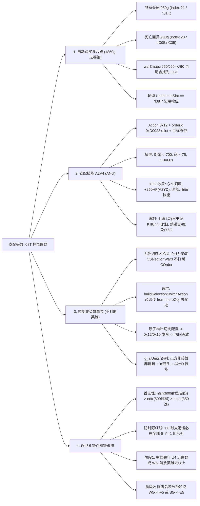

# DotA 6.83d 支配头盔自动合成与控怪囤野思维导图

```mermaid
flowchart LR
    Root["支配头盔 I08T 控怪囤野"]

    Root --> Buy["1. 自动购买与合成 (1850g, 无卷轴)"]
    Buy --> B1["铁意头盔 950g (index 21 / n01K)"]
    Buy --> B2["死亡面具 900g (index 28 / hC95,nC35)"]
    Buy --> B3["war3map.j J50/J60->JB0 自动合成为 I08T"]
    Buy --> B4["轮询 UnitItemInSlot == 'I08T' 记录槽位"]

    Root --> Dom["2. 支配技能 A2V4 (ANcl)"]
    Dom --> D1["Action 0x12 + orderId 0xD0028+slot + 目标野怪"]
    Dom --> D2["条件: 距离<=700, 蓝>=75, CD=60s"]
    Dom --> D3["YFO 效果: 永久归属, +250HP(A2YD), 满蓝, 保留技能"]
    Dom --> D4["限制: 上限1只(再支配 KillUnit 旧怪), 禁远古/魔免/Y5O"]

    Root --> Ctrl["3. 控制非英雄单位 (不打断英雄)"]
    Ctrl --> C1["无免切选区指令; 0x16 仅改 CSelectionWar3 不打断 COrder"]
    Ctrl --> C2["避坑: buildSelectionSwitchAction 必须传 from=heroObj 防双选"]
    Ctrl --> C3["原子3步: 切支配怪 -> 0x12/0x10 发令 -> 切回英雄"]
    Ctrl --> C4["g_aiUnits 识别: 己方非英雄非建筑 + 'n'开头 + A2YD 技能"]

    Root --> Stack["4. 近卫 6 野点囤野策略"]
    Stack --> S1["首选怪: nfsh(600射程/自奶) > ndtr(500射程) > ncen(350速)"]
    Stack --> S2["防封野红线: :00 时支配怪必在全部 6 个 r1 矩形外"]
    Stack --> S3["阶段1: 单怪驻守 U4 远古野或 W5, 解放英雄去线上"]
    Stack --> S4["阶段2: 囤满后跨分钟轮换 W5<->F5 或 B5<->E5"]
```
