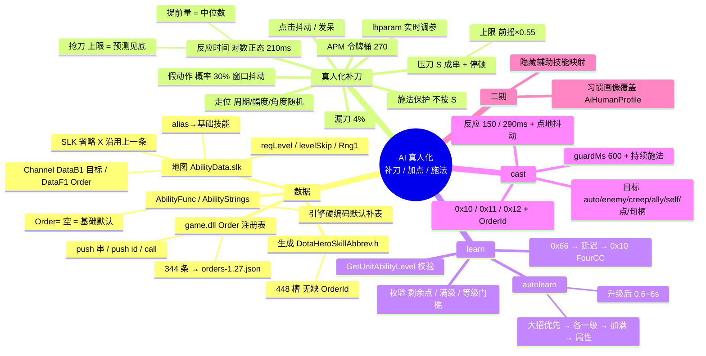

# DotA AI 真人化补刀 + learn + cast — 思维导图

> 分析模型：Claude Opus 5.5 ｜ 时间：2026-11-16 ｜ 正文：[`dota-ai-human-lasthit-learn-cast.md`](./dota-ai-human-lasthit-learn-cast.md)

```mermaid
mindmap
  root((AI 真人化<br/>补刀 / 加点 / 施法))
    数据
      game.dll Order 注册表
        push 串 / push id / call
        344 条 → orders-1.27.json
      地图 AbilityData.slk
        alias→基础技能
        Channel DataB1 目标 / DataF1 Order
        reqLevel / levelSkip / Rng1
        SLK 省略 X 沿用上一条
      AbilityFunc / AbilityStrings
        Order= 空 = 基础默认
        引擎硬编码默认补表
      生成 DotaHeroSkillAbbrev.h
        448 槽 无缺 OrderId
    真人化补刀
      反应时间 对数正态 210ms
        提前量 = 中位数
        抢刀 上限 = 预测见底
      漏刀 4%
      压刀 S 成串 + 停顿
        上限 前摇×0.55
      假动作 概率 30% 窗口抖动
      走位 周期/幅度/角度随机
      APM 令牌桶 270
      点击抖动 / 发呆
      施法保护 不按 S
      lhparam 实时调参
    learn
      校验 剩余点 / 满级 / 等级门槛
      0x66 → 延迟 → 0x10 FourCC
      GetUnitAbilityLevel 校验
      autolearn
        升级后 0.6~6s
        大招优先 → 各一级 → 加满 → 属性
    cast
      目标 auto/enemy/creep/ally/self/点/句柄
      0x10 / 0x11 / 0x12 + OrderId
      反应 150 / 290ms + 点地抖动
      guardMs 600 + 持续施法
    二期
      习惯画像覆盖 AiHumanProfile
      隐藏辅助技能映射
```
