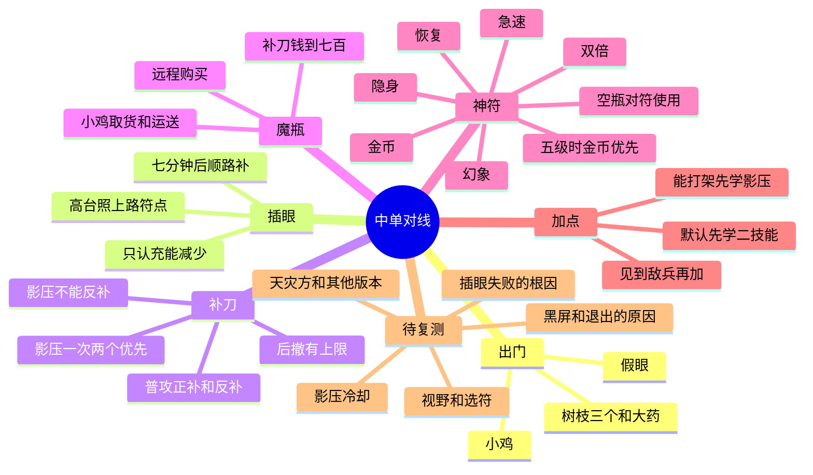

# 中单对线流程：导图

- **分析模型**：Claude Opus 5.5
- **分析目的**：`dota-ai-laning-routine.md` 的导图
- **命名方式**：正文名 + `-mindmap`
- **分析时间**：2026-11-22
- **验证状态**：实测 1 局完整 + 1 局中断；插眼实测失败，其余修正未验证

```mermaid
mindmap
  root((中单对线))
    出门
      小鸡
      树枝三个和大药
      假眼
    插眼
      高台照上路符点
      只认充能减少
      七分钟后顺路补
    补刀
      普攻正补和反补
      影压一次两个优先
      影压不能反补
      后撤有上限
    魔瓶
      补刀钱到七百
      远程购买
      小鸡取货和运送
    神符
      隐身
      急速
      双倍
      幻象
      恢复
      金币
      五级时金币优先
      空瓶对符使用
    加点
      见到敌兵再加
      默认先学二技能
      能打架先学影压
    待复测
      插眼失败的根因
      黑屏和退出的原因
      视野和选符
      影压冷却
      天灾方和其他版本
```
