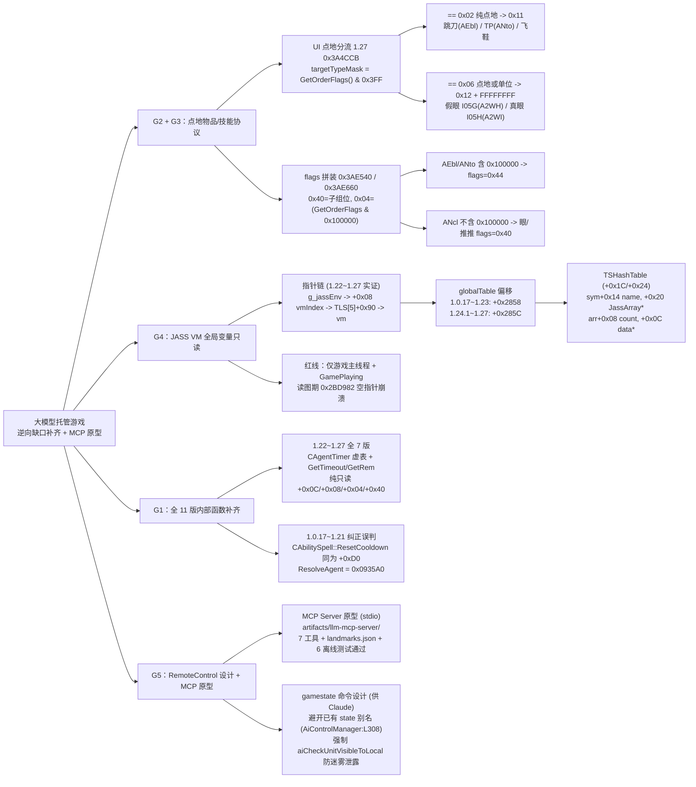

# 大模型托管 DotA 6.83d 逆向缺口与 MCP 原型 — 思维导图

- **配套正文**：[`dota-ai-llm-mcp-gaps.md`](./dota-ai-llm-mcp-gaps.md)
- **分析模型**：Gemini 4 Neon (Medium) ｜ **分析时间**：2026-11-23

```mermaid
flowchart LR
    ROOT["大模型托管游戏<br/>逆向缺口补齐 + MCP 原型"]

    ROOT --> G23["G2 + G3：点地物品/技能协议"]
    ROOT --> G4["G4：JASS VM 全局变量只读"]
    ROOT --> G1["G1：全 11 版内部函数补齐"]
    ROOT --> G5["G5：RemoteControl 设计 + MCP 原型"]

    G23 --> G23A["UI 点地分流 1.27 0x3A4CCB<br/>targetTypeMask = GetOrderFlags() & 0x3FF"]
    G23A --> G23A1["== 0x02 纯点地 -> 0x11<br/>跳刀(AEbl) / TP(ANto) / 飞鞋"]
    G23A --> G23A2["== 0x06 点地或单位 -> 0x12 + FFFFFFFF<br/>假眼 I05G(A2WH) / 真眼 I05H(A2WI)"]
    G23 --> G23B["flags 拼装 0x3AE540 / 0x3AE660<br/>0x40=子组位, 0x04=(GetOrderFlags & 0x100000)"]
    G23B --> G23B1["AEbl/ANto 含 0x100000 -> flags=0x44"]
    G23B --> G23B2["ANcl 不含 0x100000 -> 眼/推推 flags=0x40"]

    G4 --> G4A["指针链 (1.22~1.27 实证)<br/>g_jassEnv -> +0x08 vmIndex -> TLS[5]+0x90 -> vm"]
    G4A --> G4B["globalTable 偏移<br/>1.0.17~1.23: +0x2858<br/>1.24.1~1.27: +0x285C"]
    G4B --> G4C["TSHashTable (+0x1C/+0x24)<br/>sym+0x14 name, +0x20 JassArray*<br/>arr+0x08 count, +0x0C data*"]
    G4 --> G4D["红线：仅游戏主线程 + GamePlaying<br/>读图期 0x2BD982 空指针崩溃"]

    G1 --> G1A["1.22~1.27 全 7 版<br/>CAgentTimer 虚表 + GetTimeout/GetRem<br/>纯只读 +0x0C/+0x08/+0x04/+0x40"]
    G1 --> G1B["1.0.17~1.21 纠正误判<br/>CAbilitySpell::ResetCooldown 同为 +0xD0<br/>ResolveAgent = 0x0935A0"]

    G5 --> G5A["MCP Server 原型 (stdio)<br/>artifacts/llm-mcp-server/<br/>7 工具 + landmarks.json + 6 离线测试通过"]
    G5 --> G5B["gamestate 命令设计 (供 Claude)<br/>避开已有 state 别名 (AiControlManager:L308)<br/>强制 aiCheckUnitVisibleToLocal 防迷雾泄露"]
```
