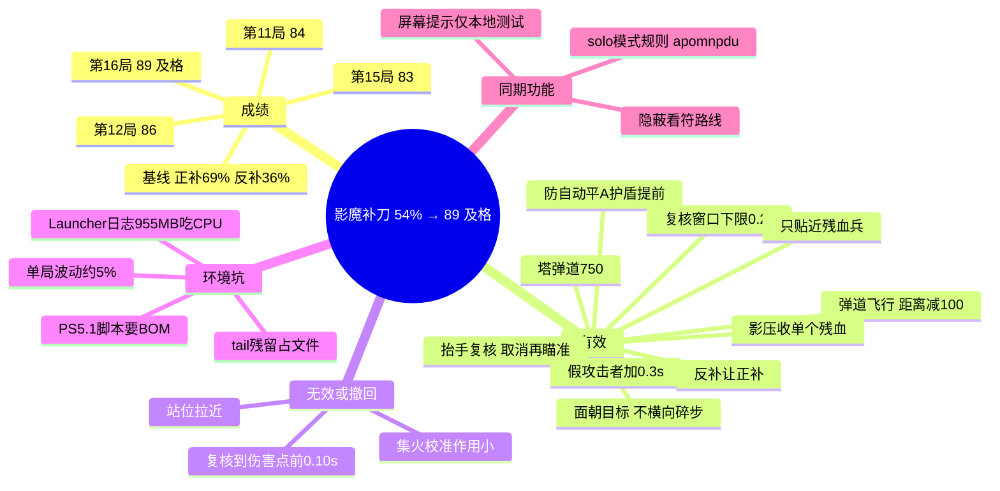

# 影魔中路 AI 补刀优化（思维导图）

- 分析模型：Claude Opus 5.5｜时间：2026-11-24｜正文：[dota-ai-sf-lasthit-optimization.md](./dota-ai-sf-lasthit-optimization.md)

```mermaid
mindmap
  root((影魔补刀 54% → 89 及格))
    成绩
      基线 正补69% 反补36%
      第11局 84
      第12局 86
      第15局 83
      第16局 89 及格
    有效
      弹道飞行 距离减100
      防自动平A护盾提前
      抬手复核 取消再瞄准
      复核窗口下限0.2s
      面朝目标 不横向碎步
      塔弹道750
      假攻击者加0.3s
      影压收单个残血
      只贴近残血兵
      反补让正补
    无效或撤回
      复核到伤害点前0.10s
      站位拉近
      集火校准作用小
    环境坑
      Launcher日志955MB吃CPU
      tail残留占文件
      PS5.1脚本要BOM
      单局波动约5%
    同期功能
      屏幕提示仅本地测试
      solo模式规则 apomnpdu
      隐蔽看符路线
```
