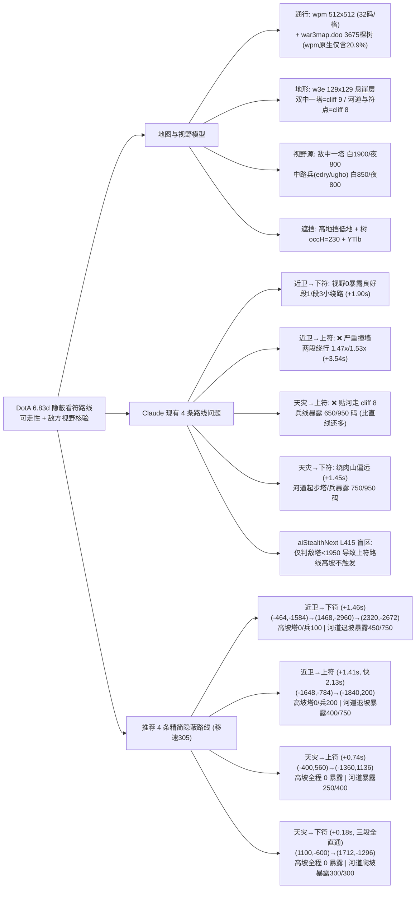

# DotA 6.83d 隐蔽看符路线核验与优化 — 思维导图

```mermaid
flowchart LR
    ROOT["DotA 6.83d 隐蔽看符路线<br/>可走性 + 敌方视野核验"]

    ROOT --> M["地图与视野模型"]
    M --> M1["通行: wpm 512x512 (32码/格)<br/>+ war3map.doo 3675棵树 (wpm原生仅含20.9%)"]
    M --> M2["地形: w3e 129x129 悬崖层<br/>双中一塔=cliff 9 / 河道与符点=cliff 8"]
    M --> M3["视野源: 敌中一塔 白1900/夜800<br/>中路兵(edry/ugho) 白850/夜800"]
    M --> M4["遮挡: 高地挡低地 + 树 occH=230 + YTlb"]

    ROOT --> C["Claude 现有 4 条路线问题"]
    C --> C1["近卫→下符: 视野0暴露良好<br/>段1/段3小绕路 (+1.90s)"]
    C --> C2["近卫→上符: ❌ 严重撞墙<br/>两段绕行 1.47x/1.53x (+3.54s)"]
    C --> C3["天灾→上符: ❌ 贴河走 cliff 8<br/>兵线暴露 650/950 码 (比直线还多)"]
    C --> C4["天灾→下符: 绕肉山偏远 (+1.45s)<br/>河道起步塔/兵暴露 750/950 码"]
    C --> C5["aiStealthNext L415 盲区:<br/>仅判敌塔<1950 导致上符路线高坡不触发"]

    ROOT --> R["推荐 4 条精简隐蔽路线 (移速305)"]
    R --> R1["近卫→下符 (+1.46s)<br/>(-464,-1584)→(1468,-2960)→(2320,-2672)<br/>高坡塔0/兵100 | 河道退坡暴露450/750"]
    R --> R2["近卫→上符 (+1.41s, 快2.13s)<br/>(-1648,-784)→(-1840,200)<br/>高坡塔0/兵200 | 河道退坡暴露400/750"]
    R --> R3["天灾→上符 (+0.74s)<br/>(-400,560)→(-1360,1136)<br/>高坡全程 0 暴露 | 河道暴露250/400"]
    R --> R4["天灾→下符 (+0.18s, 三段全直通)<br/>(1100,-600)→(1712,-1296)<br/>高坡全程 0 暴露 | 河道爬坡暴露300/300"]
```
