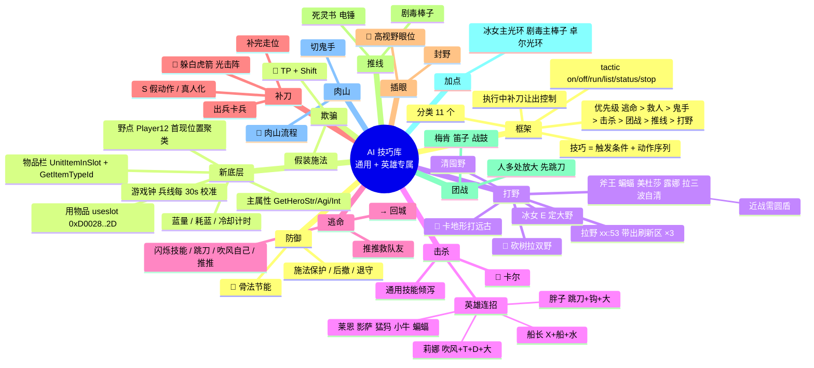

# DotA AI 技巧库 — 思维导图

> 分析模型：Claude Opus 5.5 ｜ 时间：2026-11-17 ｜ 正文：[`dota-ai-tactics-library.md`](./dota-ai-tactics-library.md)

```mermaid
mindmap
  root((AI 技巧库<br/>通用 + 英雄专属))
    框架
      技巧 = 触发条件 + 动作序列
      分类 11 个
      tactic on/off/run/list/status/stop
      优先级 逃命 > 救人 > 鬼手 > 击杀 > 团战 > 推线 > 打野
      执行中补刀让出控制
    新底层
      物品栏 UnitItemInSlot + GetItemTypeId
      用物品 useslot 0xD0028..2D
      蓝量 / 耗蓝 / 冷却计时
      游戏钟 兵线每 30s 校准
      野点 Player12 首现位置聚类
      主属性 GetHeroStr/Agi/Int
    打野
      拉野 xx:53 带出刷新区 ×3
      清囤野
      斧王 蝙蝠 美杜莎 露娜 拉三波自清
        近战需圆盾
      冰女 E 定大野
      📄 砍树拉双野
      📄 卡地形打远古
    击杀
      通用技能倾泻
      英雄连招
        莉娜 吹风+T+D+大
        胖子 跳刀+钩+大
        船长 X+船+水
        莱恩 影萨 猛犸 小牛 蝙蝠
      📄 卡尔
    逃命
      闪烁技能 / 跳刀 / 吹风自己 / 推推
      → 回城
      推推救队友
    补刀
      出兵卡兵
      补完走位
      S 假动作 / 真人化
      📄 躲白虎箭 光击阵
    插眼
      封野
      📄 高视野眼位
    推线
      死灵书 电锤
      剧毒棒子
    团战
      人多处放大 先跳刀
      梅肯 笛子 战鼓
    加点
      冰女主光环 剧毒主棒子 卓尔光环
    肉山
      切鬼手
      📄 肉山流程
    防御
      施法保护 / 后撤 / 退守
      📄 骨法节能
    欺骗
      假装施法
      📄 TP + Shift
```
