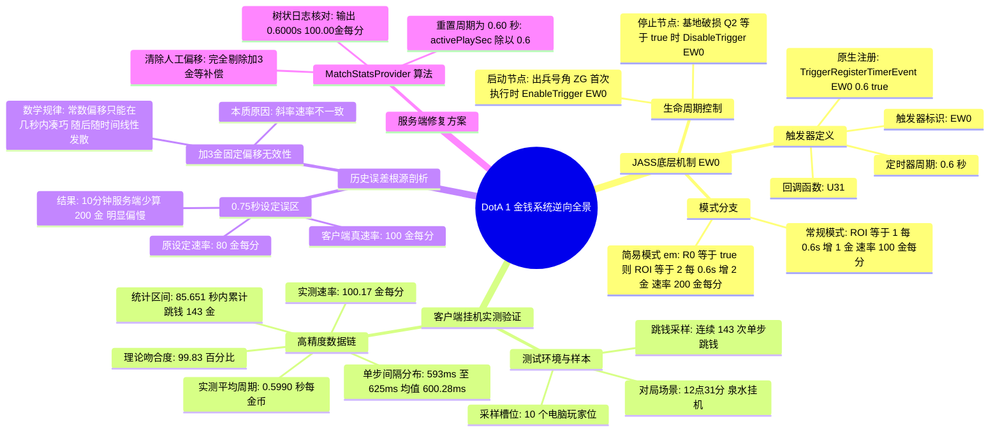

# DotA 1 自然跳钱机制与实测基准思维导图

```mermaid
mindmap
  root((DotA 1 金钱系统逆向全景))
    JASS底层机制 EW0
      触发器定义
        触发器标识: EW0
        定时器周期: 0.6 秒
        原生注册: TriggerRegisterTimerEvent EW0 0.6 true
        回调函数: U31
      模式分支
        常规模式: ROI 等于 1 每 0.6s 增 1 金 速率 100 金每分
        简易模式 em: R0 等于 true 则 ROI 等于 2 每 0.6s 增 2 金 速率 200 金每分
      生命周期控制
        启动节点: 出兵号角 ZG 首次执行时 EnableTrigger EW0
        停止节点: 基地破损 Q2 等于 true 时 DisableTrigger EW0
    客户端挂机实测验证
      测试环境与样本
        对局场景: 12点31分 泉水挂机
        采样槽位: 10 个电脑玩家位
        跳钱采样: 连续 143 次单步跳钱
      高精度数据链
        统计区间: 85.651 秒内累计跳钱 143 金
        实测平均周期: 0.5990 秒每金币
        单步间隔分布: 593ms 至 625ms 均值 600.28ms
        实测速率: 100.17 金每分
        理论吻合度: 99.83 百分比
    历史误差根源剖析
      0.75秒设定误区
        原设定速率: 80 金每分
        客户端真速率: 100 金每分
        结果: 10分钟服务端少算 200 金 明显偏慢
      加3金固定偏移无效性
        本质原因: 斜率速率不一致
        数学规律: 常数偏移只能在几秒内凑巧 随后随时间线性发散
    服务端修复方案
      MatchStatsProvider 算法
        重置周期为 0.60 秒: activePlaySec 除以 0.6
        清除人工偏移: 完全剔除加3金等补偿
        树状日志核对: 输出 0.6000s 100.00金每分
```
