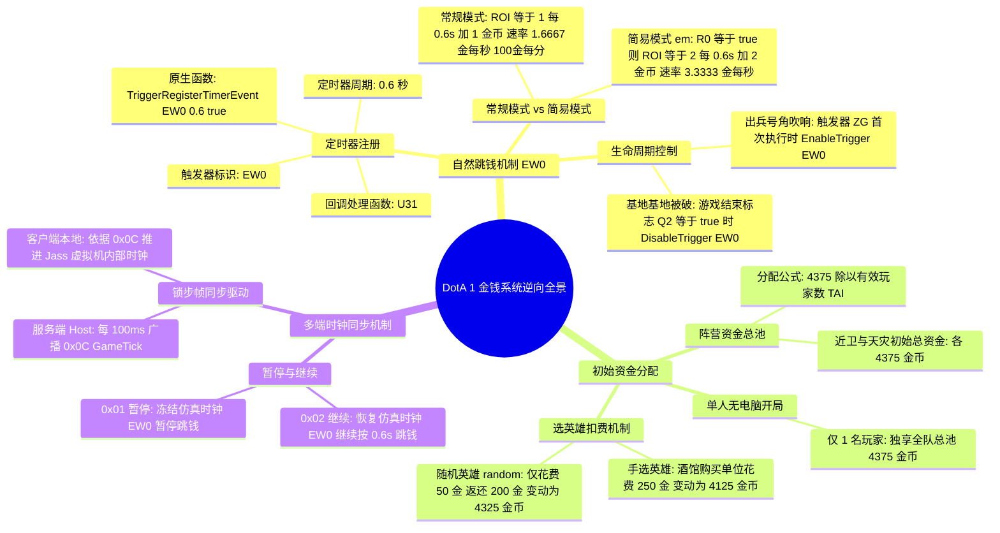

# DotA 1 自然跳钱与初始资金全景思维导图

```mermaid
mindmap
  root((DotA 1 金钱系统逆向全景))
    自然跳钱机制 EW0
      定时器注册
        触发器标识: EW0
        定时器周期: 0.6 秒
        原生函数: TriggerRegisterTimerEvent EW0 0.6 true
        回调处理函数: U31
      常规模式 vs 简易模式
        常规模式: ROI 等于 1 每 0.6s 加 1 金币 速率 1.6667 金每秒 100金每分
        简易模式 em: R0 等于 true 则 ROI 等于 2 每 0.6s 加 2 金币 速率 3.3333 金每秒
      生命周期控制
        出兵号角吹响: 触发器 ZG 首次执行时 EnableTrigger EW0
        基地基地被破: 游戏结束标志 Q2 等于 true 时 DisableTrigger EW0
    初始资金分配
      阵营资金总池
        近卫与天灾初始总资金: 各 4375 金币
        分配公式: 4375 除以有效玩家数 TAI
      单人无电脑开局
        仅 1 名玩家: 独享全队总池 4375 金币
      选英雄扣费机制
        手选英雄: 酒馆购买单位花费 250 金 变动为 4125 金币
        随机英雄 random: 仅花费 50 金 返还 200 金 变动为 4325 金币
    多端时钟同步机制
      锁步帧同步驱动
        服务端 Host: 每 100ms 广播 0x0C GameTick
        客户端本地: 依据 0x0C 推进 Jass 虚拟机内部时钟
      暂停与继续
        0x01 暂停: 冻结仿真时钟 EW0 暂停跳钱
        0x02 继续: 恢复仿真时钟 EW0 继续按 0.6s 跳钱
```

