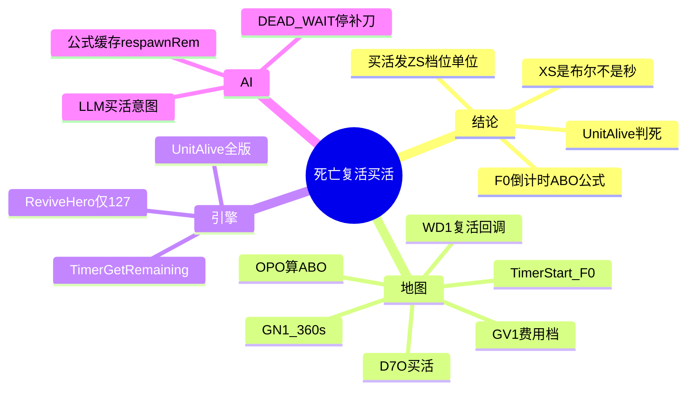

# 英雄死亡 / 复活 / 买活 — 思维导图

```mermaid
mindmap
  root((死亡复活买活))
    结论
      F0倒计时ABO公式
      UnitAlive判死
      买活发ZS档位单位
      XS是布尔不是秒
    地图
      OPO算ABO
      TimerStart_F0
      WD1复活回调
      GV1费用档
      D7O买活
      GN1_360s
    引擎
      UnitAlive全版
      TimerGetRemaining
      ReviveHero仅127
    AI
      DEAD_WAIT停补刀
      公式缓存respawnRem
      LLM买活意图
```
