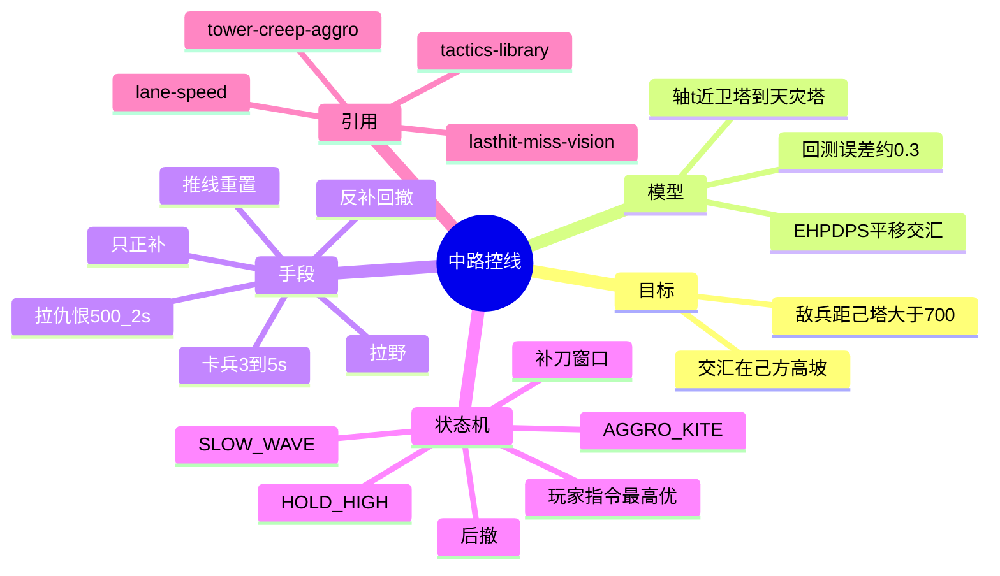

# 中路控线 — 思维导图

```mermaid
mindmap
  root((中路控线))
    目标
      交汇在己方高坡
      敌兵距己塔大于700
    模型
      轴t近卫塔到天灾塔
      EHPDPS平移交汇
      回测误差约0.3
    手段
      只正补
      反补回撤
      拉仇恨500_2s
      卡兵3到5s
      推线重置
      拉野
    状态机
      玩家指令最高优
      后撤
      补刀窗口
      HOLD_HIGH
      SLOW_WAVE
      AGGRO_KITE
    引用
      lane-speed
      tower-creep-aggro
      tactics-library
      lasthit-miss-vision
```
