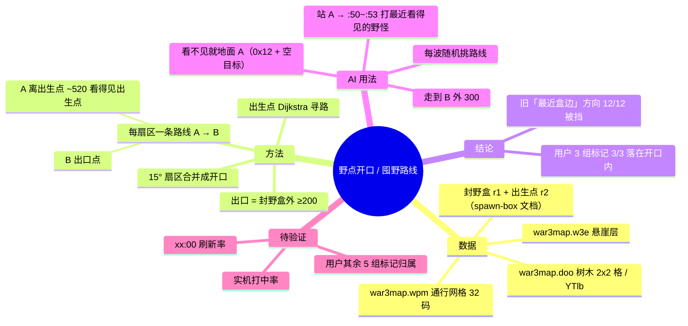

# DotA 6.83d 野点开口与囤野路线（思维导图）

> 正文：[`dota-neutral-camp-openings.md`](./dota-neutral-camp-openings.md) · 模型 Claude Opus 5.5 · 2026-11-24

```mermaid
mindmap
  root((野点开口 / 囤野路线))
    数据
      war3map.wpm 通行网格 32 码
      war3map.doo 树木 2x2 格 / YTlb
      war3map.w3e 悬崖层
      封野盒 r1 + 出生点 r2（spawn-box 文档）
    方法
      出生点 Dijkstra 寻路
      出口 = 封野盒外 ≥200
      15° 扇区合并成开口
      每扇区一条路线 A → B
        A 离出生点 ~520 看得见出生点
        B 出口点
    结论
      旧「最近盒边」方向 12/12 被挡
      用户 3 组标记 3/3 落在开口内
    AI 用法
      每波随机挑路线
      站 A → :50~:53 打最近看得见的野怪
      走到 B 外 300
      看不见就地面 A（0x12 + 空目标）
    待验证
      实机打中率
      xx:00 刷新率
      用户其余 5 组标记归属
```
