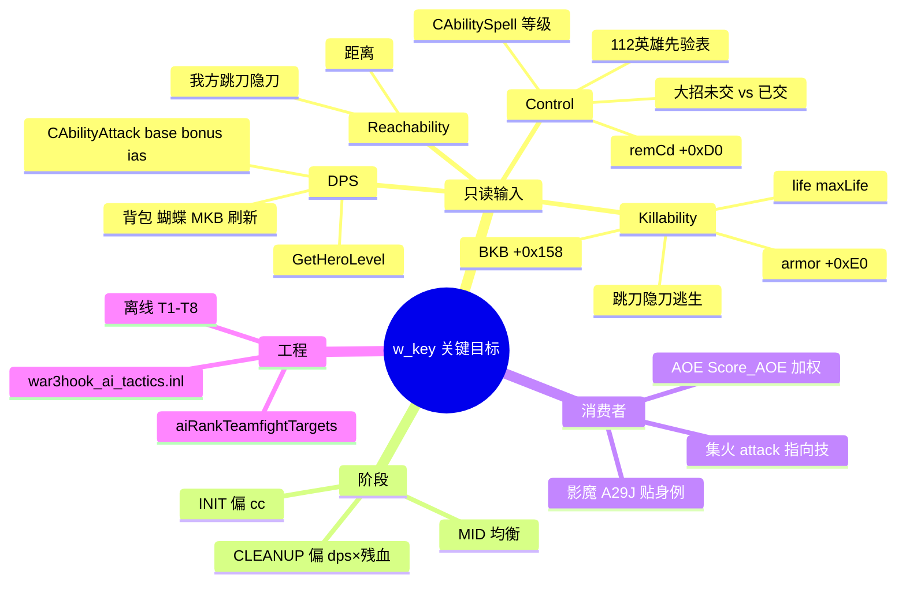

# 团战关键目标评分 — 思维导图

```mermaid
mindmap
  root((w_key 关键目标))
    只读输入
      DPS
        CAbilityAttack base bonus ias
        背包 蝴蝶 MKB 刷新
        GetHeroLevel
      Control
        112英雄先验表
        CAbilitySpell 等级
        remCd +0xD0
        大招未交 vs 已交
      Killability
        life maxLife
        armor +0xE0
        BKB +0x158
        跳刀隐刀逃生
      Reachability
        距离
        我方跳刀隐刀
    阶段
      INIT 偏 cc
      MID 均衡
      CLEANUP 偏 dps×残血
    消费者
      集火 attack 指向技
      AOE Score_AOE 加权
      影魔 A29J 贴身例
    工程
      aiRankTeamfightTargets
      war3hook_ai_tactics.inl
      离线 T1-T8
```
