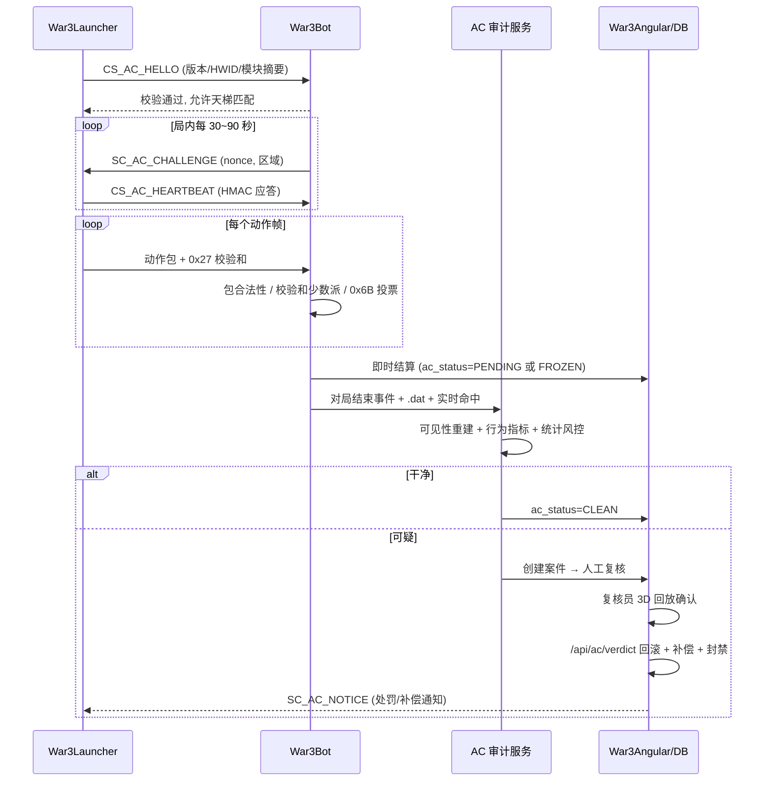
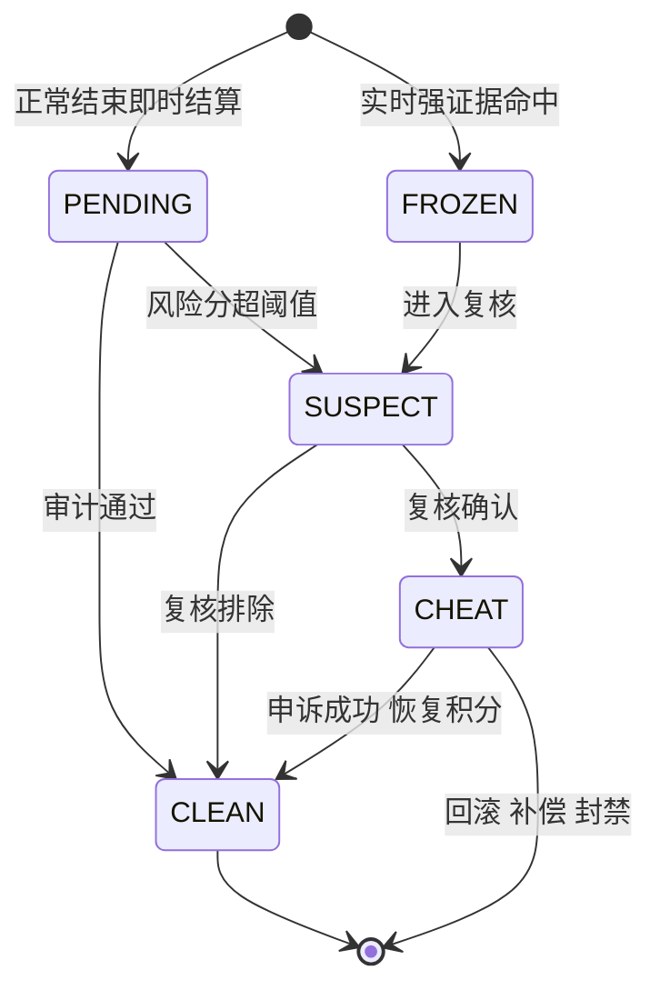

# Dota1 反外挂系统设计 — 思维导图与流程图

详细设计见：[`dota1-anti-cheat-system-design.md`](./dota1-anti-cheat-system-design.md)

---

## 一、全景思维导图

```mermaid
graph LR
    Root["Dota1 反外挂系统"]

    %% 1. 威胁模型
    Root --> T["1. 威胁模型"]
    T --> T1["只读类: 全图/显隐/信息辅助"]
    T --> T2["脚本类: 自动技能/秒控/宏"]
    T --> T3["改数值类: 内存改钱改血 (锁步会 Desync)"]
    T --> T4["协议类: 伪造动作/篡改 0x6B/伪造离线"]
    T --> T5["网络类: Lag 攻击/团战拔线"]
    T --> T6["天梯舞弊: 互刷/送人头/代练/小号"]

    %% 2. L1 客户端
    Root --> L1["2. L1 客户端完整性 (War3Launcher)"]
    L1 --> L1a["Game.dll/Storm.dll 代码段分块哈希"]
    L1a --> L1a1["重点: 迷雾渲染/小地图/可见性判定补丁点"]
    L1a --> L1a2["白名单: FPS/视距/改键/地图大小合法补丁"]
    L1 --> L1b["模块枚举 + 手动映射内存页检测"]
    L1 --> L1c["外部进程读写句柄扫描"]
    L1 --> L1d["反调试 + 混淆加壳 + 热更新"]
    L1 --> L1e["服务器挑战应答心跳 (nonce + 区域哈希)"]
    L1 --> L1f["HWID 设备指纹 (加盐哈希)"]

    %% 3. L2 主机
    Root --> L2["3. L2 主机实时校验 (War3Bot)"]
    L2 --> L2a["0x27 校验和比对: 少数派即异常"]
    L2 --> L2b["动作包: ID/长度/频率/APM 上限"]
    L2 --> L2c["0x6B 战绩 10 端多数投票"]
    L2 --> L2d["RTT/丢包/等待/团战拔线监控"]
    L2 --> L2e["命中事件随 .dat 投递审计"]

    %% 4. L3 回放审计
    Root --> L3["4. L3 回放行为审计 (.dat)"]
    L3 --> L3v["可见性重建"]
    L3v --> L3v1["近似: 轨迹 + 视野半径 + 眼位 (全量)"]
    L3v --> L3v2["精确: 真实 War3 复算 + Hook 可见性 (复核)"]
    L3 --> L3a["雾中目标交互 0x12/0x16/0x19 (强证据)"]
    L3 --> L3b["无真视命中隐身单位 (强证据)"]
    L3 --> L3c["0x68 Ping 命中雾中英雄"]
    L3 --> L3d["Gank 撤退提前量/盲眼/预判 TP"]
    L3 --> L3e["反应时间 < 80ms 且低方差 (脚本)"]
    L3 --> L3f["点击节律熵/周期性/坐标重复"]
    L3 --> L3g["跨局累积评分, 弱证据不单独定罪"]

    %% 5. L4 统计
    Root --> L4["5. L4 天梯统计风控"]
    L4 --> L4a["Performance Z 分数 > 3 持续"]
    L4 --> L4b["新号胜率/上分速度异常"]
    L4 --> L4c["时段/设备表现突变 (共享/代练)"]
    L4 --> L4d["对局共现图 + 送人头对 (互刷团伙)"]
    L4 --> L4e["挂机: APM≈0/泉水徘徊"]

    %% 6. L5 关联
    Root --> L5["6. L5 账号设备关联"]
    L5 --> L5a["账号-HWID-IP 关联簇"]
    L5 --> L5b["封禁粒度: 账号/HWID/关联簇"]
    L5 --> L5c["同设备分处对立两侧 → 本局无效"]

    %% 7. 天梯对接
    Root --> L6["7. 处置与天梯对接"]
    L6 --> L6a["两阶段结算: 即时生效 + ac_status 待确认"]
    L6 --> L6b["强证据实时命中 → FROZEN 不结算"]
    L6 --> L6c["POST /api/ac/verdict (HMAC + Nonce + 幂等)"]
    L6c --> L6c1["作弊者: 回滚 + 追溯 + 扣分 + 清连胜"]
    L6c --> L6c2["对手: 失分全额返还 + 托盘通知"]
    L6c --> L6c3["队友: 不连坐"]
    L6 --> L6d["处罚阶梯: 观察/警告/临封/永封"]
    L6 --> L6e["信誉分 Trust Score → 匹配隔离池"]
    L6 --> L6f["举报加权 + Web 申诉"]
    L6 --> L6g["延迟批量封禁 Ban Wave"]

    %% 8. 复核后台
    Root --> R["8. 复核后台 (War3Angular)"]
    R --> R1["案件按风险分排序"]
    R --> R2["证据时间线一键跳 3D 回放"]
    R --> R3["下令玩家视角迷雾渲染"]
    R --> R4["永封双人确认 + 审计日志"]

    %% 9. 路线图
    Root --> P["9. 落地路线图"]
    P --> P0["P0: 校验和/0x6B 投票/包校验/回滚接口"]
    P --> P1["P1: HWID/关联/举报/复核雏形"]
    P --> P2["P2: 离线审计 Worker 行为指标"]
    P --> P3["P3: 客户端心跳/回放复算/信誉池"]
```

---

## 二、对局全流程时序

```mermaid
sequenceDiagram
    participant L as War3Launcher
    participant B as War3Bot
    participant A as AC 审计服务
    participant W as War3Angular/DB

    L->>B: CS_AC_HELLO (版本/HWID/模块摘要)
    B-->>L: 校验通过, 允许天梯匹配
    loop 局内每 30~90 秒
        B->>L: SC_AC_CHALLENGE (nonce, 区域)
        L->>B: CS_AC_HEARTBEAT (HMAC 应答)
    end
    loop 每个动作帧
        L->>B: 动作包 + 0x27 校验和
        B->>B: 包合法性 / 校验和少数派 / 0x6B 投票
    end
    B->>W: 即时结算 (ac_status=PENDING 或 FROZEN)
    B->>A: 对局结束事件 + .dat + 实时命中
    A->>A: 可见性重建 + 行为指标 + 统计风控
    alt 干净
        A->>W: ac_status=CLEAN
    else 可疑
        A->>W: 创建案件 → 人工复核
        W->>W: 复核员 3D 回放确认
        W->>W: /api/ac/verdict 回滚 + 补偿 + 封禁
        W-->>L: SC_AC_NOTICE (处罚/补偿通知)
    end
```

---

## 三、结算状态机

```mermaid
stateDiagram-v2
    [*] --> PENDING: 正常结束即时结算
    [*] --> FROZEN: 实时强证据命中
    PENDING --> CLEAN: 审计通过
    PENDING --> SUSPECT: 风险分超阈值
    FROZEN --> SUSPECT: 进入复核
    SUSPECT --> CLEAN: 复核排除
    SUSPECT --> CHEAT: 复核确认
    CHEAT --> CLEAN: 申诉成功 恢复积分
    CLEAN --> [*]
    CHEAT --> [*]: 回滚 补偿 封禁
```

