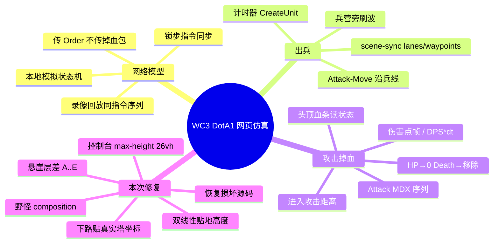

# DotA1 网页端本地动作 / replay3d 修复 · 脑图

```mermaid
mindmap
  root((WC3 DotA1 网页仿真))
    网络模型
      锁步指令同步
      传 Order 不传掉血包
      本地模拟状态机
      录像回放同指令序列
    出兵
      计时器 CreateUnit
      兵营旁刷波
      Attack-Move 沿兵线
      scene-sync lanes/waypoints
    攻击掉血
      进入攻击距离
      Attack MDX 序列
      伤害点帧 / DPS*dt
      HP→0 Death→移除
      头顶血条读状态
    本次修复
      恢复损坏源码
      下路贴真实塔坐标
      控制台 max-height 26vh
      双线性贴地高度
      悬崖层差 A..E
      野怪 composition
```
