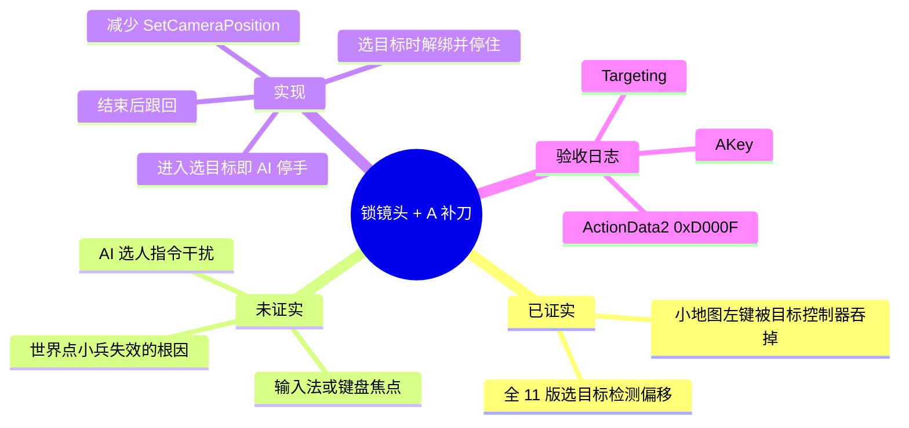

# 锁镜头选目标复核：导图

- **分析模型**：Claude Opus 5.5
- **分析目的**：`war3-camera-lock-targeting-verify.md` 的导图
- **命名方式**：正文名 + `-mindmap`
- **分析时间**：2026-11-21
- **验证状态**：静态核对，未实机验证

```mermaid
mindmap
  root((锁镜头 + A 补刀))
    已证实
      小地图左键被目标控制器吞掉
      全 11 版选目标检测偏移
    未证实
      世界点小兵失效的根因
      输入法或键盘焦点
      AI 选人指令干扰
    实现
      选目标时解绑并停住
      结束后跟回
      进入选目标即 AI 停手
      减少 SetCameraPosition
    验收日志
      AKey
      Targeting
      ActionData2 0xD000F
```
