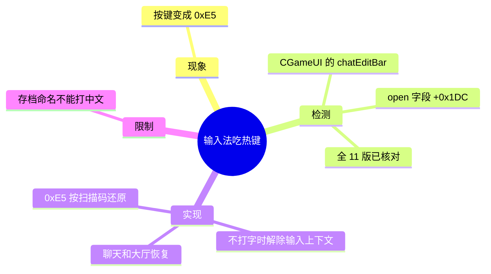

# 对局中输入法开关：导图

- **分析模型**：Claude Opus 5.5
- **分析目的**：`war3-chat-open-ime.md` 的导图
- **命名方式**：正文名 + `-mindmap`
- **分析时间**：2026-11-21
- **验证状态**：全 11 版静态核对；1.27 实机通过，其它版本未实机验证

```mermaid
mindmap
  root((输入法吃热键))
    现象
      按键变成 0xE5
    检测
      CGameUI 的 chatEditBar
      open 字段 +0x1DC
      全 11 版已核对
    实现
      不打字时解除输入上下文
      聊天和大厅恢复
      0xE5 按扫描码还原
    限制
      存档命名不能打中文
```
