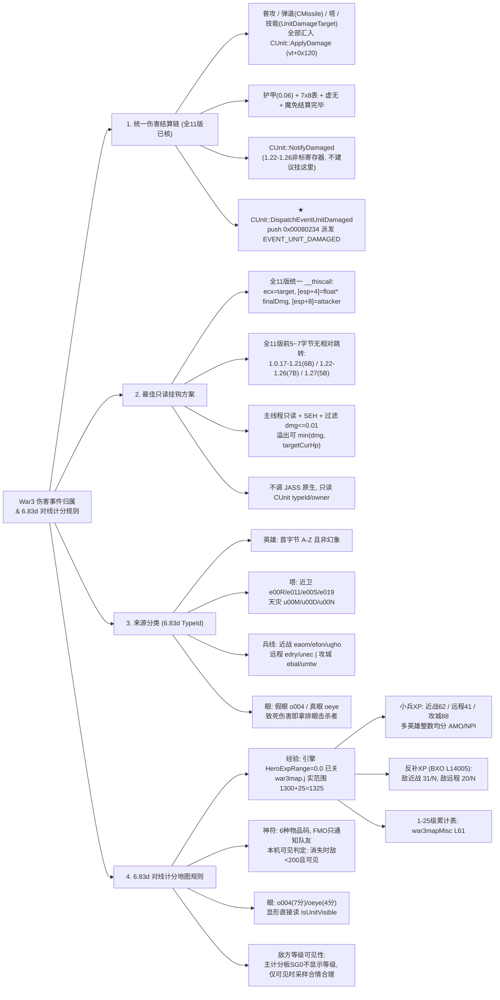

# War3 伤害事件归属（全 11 版）与 6.83d 对线计分规则 — 思维导图

```mermaid
flowchart LR
    ROOT["War3 伤害事件归属<br/>& 6.83d 对线计分规则"]

    ROOT --> D1["1. 统一伤害结算链 (全11版已核)"]
    D1 --> D1A["普攻 / 弹道(CMissile) / 塔 / 技能(UnitDamageTarget)<br/>全部汇入 CUnit::ApplyDamage (vt+0x120)"]
    D1 --> D1B["护甲(0.06) + 7x8表 + 虚无 + 魔免结算完毕"]
    D1 --> D1C["CUnit::NotifyDamaged<br/>(1.22-1.26非标寄存器, 不建议挂这里)"]
    D1 --> D1D["★ CUnit::DispatchEventUnitDamaged<br/>push 0x00080234 派发 EVENT_UNIT_DAMAGED"]

    ROOT --> D2["2. 最佳只读挂钩方案"]
    D2 --> D2A["全11版统一 __thiscall:<br/>ecx=target, [esp+4]=float* finalDmg, [esp+8]=attacker"]
    D2 --> D2B["全11版前5~7字节无相对跳转:<br/>1.0.17-1.21(6B) / 1.22-1.26(7B) / 1.27(5B)"]
    D2 --> D2C["主线程只读 + SEH + 过滤 dmg<=0.01<br/>溢出可 min(dmg, targetCurHp)"]
    D2 --> D2D["不调 JASS 原生, 只读 CUnit typeId/owner"]

    ROOT --> D3["3. 来源分类 (6.83d TypeId)"]
    D3 --> D3A["英雄: 首字节 A-Z 且非幻象"]
    D3 --> D3B["塔: 近卫 e00R/e011/e00S/e019<br/>天灾 u00M/u00D/u00N"]
    D3 --> D3C["兵线: 近战 eaom/efon/ugho<br/>远程 edry/unec | 攻城 ebal/umtw"]
    D3 --> D3D["眼: 假眼 o004 / 真眼 oeye<br/>致死伤害即拿排眼击杀者"]

    ROOT --> R["4. 6.83d 对线计分地图规则"]
    R --> R1["经验: 引擎 HeroExpRange=0.0 已关<br/>war3map.j 实范围 1300+25=1325"]
    R1 --> R1A["小兵XP: 近战62 / 远程41 / 攻城88<br/>多英雄整数均分 AMO/NPI"]
    R1 --> R1B["反补XP (BXO L14005):<br/>敌近战 31/N, 敌远程 20/N"]
    R1 --> R1C["1-25级累计表: war3mapMisc L61"]
    R --> R2["神符: 6种物品码, FMO只通知队友<br/>本机可见判定: 消失时敌<200且可见"]
    R --> R3["眼: o004(7分)/oeye(4分)<br/>显形直接读 IsUnitVisible"]
    R --> R4["敌方等级可见性:<br/>主计分板SG0不显示等级, 仅可见时采样合情合理"]
```
