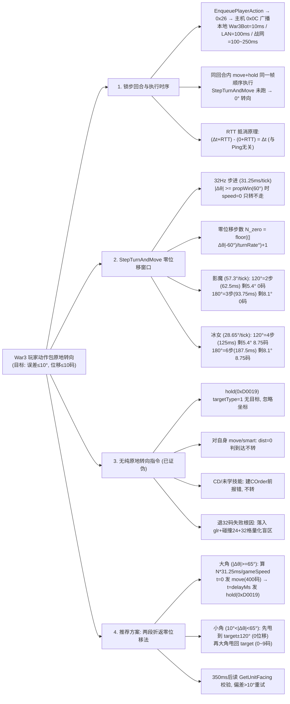

# War3 原地转向（锁步回合 / 零位移窗口 / 推荐方案）— 思维导图

```mermaid
flowchart LR
    ROOT["War3 玩家动作包原地转向<br/>(目标: 误差≤10°, 位移≤10码)"]

    ROOT --> L["1. 锁步回合与执行时序"]
    L --> L1["EnqueuePlayerAction → 0x26 → 主机 0x0C 广播<br/>本地 War3Bot=10ms / LAN=100ms / 战网=100~250ms"]
    L --> L2["同回合内 move+hold 同一帧顺序执行<br/>StepTurnAndMove 未跑 → 0° 转向"]
    L --> L3["RTT 抵消原理:<br/>(Δt+RTT) - (0+RTT) = Δt (与Ping无关)"]

    ROOT --> E["2. StepTurnAndMove 零位移窗口"]
    E --> E1["32Hz 步进 (31.25ms/tick)<br/>|Δθ| >= propWin(60°) 时 speed=0 只转不走"]
    E --> E2["零位移步数 N_zero = floor((|Δθ|-60°)/turnRate°)+1"]
    E --> E3["影魔 (57.3°/tick): 120°=2步(62.5ms) 剩5.4° 0码<br/>180°=3步(93.75ms) 剩8.1° 0码"]
    E --> E4["冰女 (28.65°/tick): 120°=4步(125ms) 剩5.4° 8.75码<br/>180°=6步(187.5ms) 剩8.1° 8.75码"]

    ROOT --> N["3. 无纯原地转向指令 (已证伪)"]
    N --> N1["hold(0xD0019) targetType=1 无目标, 忽略坐标"]
    N --> N2["对自身 move/smart: dist=0 判到达不转"]
    N --> N3["CD/未学技能: 建COrder前报错, 不转"]
    N --> N4["退32码失败根因: 落入 glr+碰撞24+32格量化盲区"]

    ROOT --> S["4. 推荐方案: 两段折返零位移法"]
    S --> S1["大角 (|Δθ|>=65°): 算 N*31.25ms/gameSpeed<br/>t=0 发 move(400码) → t=delayMs 发 hold(0xD0019)"]
    S --> S2["小角 (10°<|Δθ|<65°): 先甩到 target±120° (0位移)<br/>再大角甩回 target (0~9码)"]
    S --> S3["350ms后读 GetUnitFacing 校验, 偏差>10°重试"]
```
