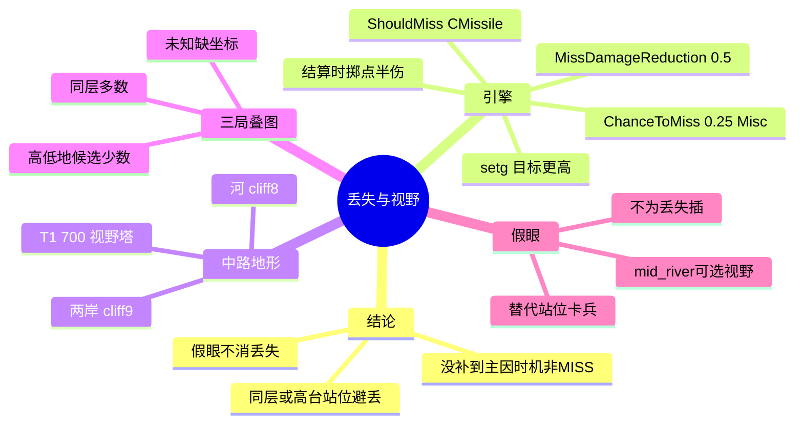

# 补刀丢失 / 中路视野 — 思维导图

```mermaid
mindmap
  root((丢失与视野))
    结论
      同层或高台站位避丢
      假眼不消丢失
      没补到主因时机非MISS
    引擎
      ChanceToMiss 0.25 Misc
      MissDamageReduction 0.5
      ShouldMiss CMissile
      setg 目标更高
      结算时掷点半伤
    中路地形
      河 cliff8
      两岸 cliff9
      T1 700 视野塔
    三局叠图
      同层多数
      高低地候选少数
      未知缺坐标
    假眼
      不为丢失插
      mid_river可选视野
      替代站位卡兵
```

## 关键边

- Misc 未覆盖 → 库存 0.25 / 0.5  
- 全版本 ShouldMiss RVA 表在 artifacts  
- 近战 / 迷雾指令：未确认  
