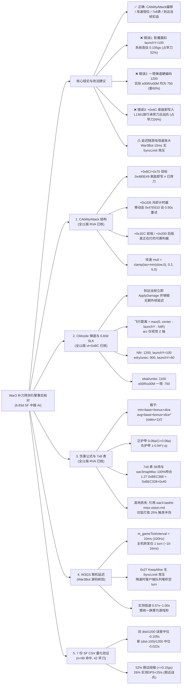

# War3 补刀预测引擎事实核对与实测验证 — 思维导图

```mermaid
flowchart LR
    ROOT["War3 补刀预测引擎事实核对<br/>(6.83d SF 中路 AI)"]

    ROOT --> C0["核心结论与改法建议"]
    C0 --> C0A["✅ 正确: CAbilityAttack偏移 / 攻速钳位 / 7x8表 / 到达当帧扣血"]
    C0 --> C0B["❌ 错误1: 影魔漏扣 launchY=100<br/>系统高估 0.105gs (占早刀52%)"]
    C0 --> C0C["❌ 错误2: 一塔弹道硬编码 1200<br/>实际 e00R/u00M 均为 750 (差60%)"]
    C0 --> C0D["❌ 错误3: +0x6C 索敌即写入<br/>L1361放行未挥刀近战兵 (占早刀26%)"]
    C0 --> C0E["⚠ 延迟随游戏倍速放大<br/>War3Bot 10ms 无 SyncLimit 背压"]

    ROOT --> C1["1. CAbilityAttack 结构<br/>(全11版 RVA 已核)"]
    C1 --> C1A["+0x6C/+0x70 目标<br/>0x480E49 索敌即写 ≠ 已挥刀"]
    C1 --> C1B["+0x1D8 冷却计时器<br/>移动态 0x47E610 设 0.50s 重试"]
    C1 --> C1C["+0x1EC 前摇 / +0x200 后摇<br/>真正在打的可靠判据"]
    C1 --> C1D["攻速 mult = clamp(ias+min(slow,0), 0.2, 5.0)"]

    ROOT --> C2["2. CMissile 弹道与 6.83d SLK<br/>(全11版 vt+0xBC 已核)"]
    C2 --> C2A["到达当帧立即 ApplyDamage 并销毁<br/>无额外帧延迟"]
    C2 --> C2B["飞行距离 = max(0, center - launchY - hitR)<br/>arc 仅视觉 Z 轴"]
    C2 --> C2C["Nfir: 1200, launchY=100<br/>edry/unec: 900, launchY=60"]
    C2 --> C2D["ebal/umtw: 1100<br/>e00R/u00M 一塔: 750"]

    ROOT --> C3["3. 伤害公式与 7x8 表<br/>(全11版 RVA 已核)"]
    C3 --> C3A["骰子: min=base+bonus+dice<br/>avg=base+bonus+dice*(sides+1)/2"]
    C3 --> C3B["正护甲 0.06a/(1+0.06a)<br/>负护甲 1-0.94^(-a)"]
    C3 --> C3C["7x8 表 56项与 war3mapMisc 100%吻合<br/>1.27 0xBEC368 = 0xBEC328+0x40"]
    C3 --> C3D["高地丢失: 引用 war3-lasthit-miss-vision.md<br/>仅低打高 25% 触发半伤"]

    ROOT --> C4["4. W3GS 联机延迟<br/>(War3Bot 源码核验)"]
    C4 --> C4A["m_gameTickInterval = 10ms (100Hz)<br/>主机转发仅 1 turn (~10-16ms)"]
    C4 --> C4B["0x27 KeepAlive 无 SyncLimit 背压<br/>降速时客户端队列堆积空 turn"]
    C4 --> C4C["实测倍速 0.57x~1.00x<br/>需统一换算为游戏秒"]

    ROOT --> C5["5. 7 份 SF CSV 量化验证<br/>(n=99 命中, 42 早刀)"]
    C5 --> C5A["旧 dist/1200 误差中位 -0.105s<br/>新 (dist-100)/1200 中位 -0.022s"]
    C5 --> C5B["52% 擦边抢输 (<=0.15gs)<br/>26% 实测DPS<25/s (假近战兵)"]
```
