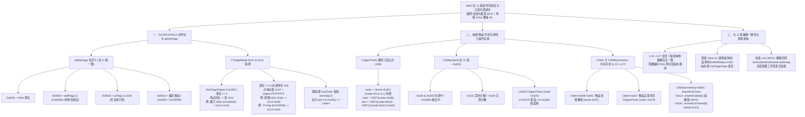

# War3 动作包协议与技能/物品/共享冷却只读逆向 思维导图

```mermaid
flowchart TD
    Root["War3 全 11 版动作包协议与只读冷却逆向<br/>(服务在线大模型 MCP + 离线 10ms 微操 AI)"]

    Root --> P1["一、0x10/0x11/0x12 动作包与 abilityFlags"]
    Root --> P2["二、技能/物品/共享冷却纯只读内存链"]
    Root --> P3["三、全 11 版偏移一致性与落地架构"]

    P1 --> P1A["abilityFlags 位定义 (全 11 版一致)"]
    P1A --> F1["0x0001 = Shift 排队"]
    P1A --> F2["0x0004 = abilFlags & 0x100000 (单单位施法)"]
    P1A --> F3["0x0040 = uiFlags & 0x04 (仅当前子组)"]
    P1A --> F4["0x0010 = 编队移动 / 0x0020 = 0x200000"]

    P1 --> P1B["CTargetMode 0x11 vs 0x12 铁律"]
    P1B --> T2["GetTargetType(vt+0x30C) 低位 == 2<br/>纯点目标 -> 发 0x11<br/>例: 跳刀 AEbl (0x100002) -> 0x11+0x44"]
    P1B --> T6["低位 == 6 (点或单位 2|4)<br/>点地必发 0x12 + target=FFFFFFFF<br/>例: 假眼 ANcl (0x6) -> 0x12+0x40<br/>例: TP AItp (0x100006) -> 0x12+0x44"]
    P1B --> TItem["模拟端 CanOrder 校验 itemObj1/2<br/>比对 abil->vt+0xA0() == CItem*"]

    P2 --> P2A["CAgentTimer 通用只读公式 (20B)"]
    P2A --> TForm["node = *(timer+0x0C)<br/>!(node+0x12 & 1) 有效<br/>total = *(f32*)(node+0x08)<br/>rem = *(f32*)(node+0x04) - *(f32*)(*(node+0x0C)+0x40)"]

    P2 --> P2B["CAbilitySpell (全 11 版 +0xD0)"]
    P2B --> S1["+0x20 & 0x200 冷却中 / +0x2000 施法中"]
    P2B --> S2["+0x3C 禁用计数 / +0x44 沉默计数"]
    P2B --> S3["+0xD0 CAgentTimer (node +0xDC)<br/>vt+0x370 查蓝 / vt+0x3D4 取蓝耗"]

    P2 --> P2C["CItem 与 CAbilityInventory 共享冷却 (1.22~1.27)"]
    P2C --> I1["CItem+0x98/+0x9C: 物品技能数组 (stride 0x0C)"]
    P2C --> I2["CItem+0xE4: 物品自身冷却 CAgentTimer (node +0xF0)"]
    P2C --> I3["CAbilityInventory+0xBC: sharedCdCount<br/>+0xC0: sharedCdIds[6] (如魔瓶 A0FO)<br/>+0xDC: sharedCdTimers[6] (stride 0x14)"]

    P3 --> P3A["1.22~1.27 全部 7 版结构体偏移完全一致<br/>零硬编码 RVA 即可全版本通用"]
    P3 --> P3B["离线 10ms AI: 废除墙钟/扣蓝等待/bottleReady+0.65s<br/>动态按 GetTargetType 发包"]
    P3 --> P3C["在线 LLM (MCP): 精确回传 remCd/totalCd/manaCost/ready<br/>高层意图工具零发包失败"]
```
