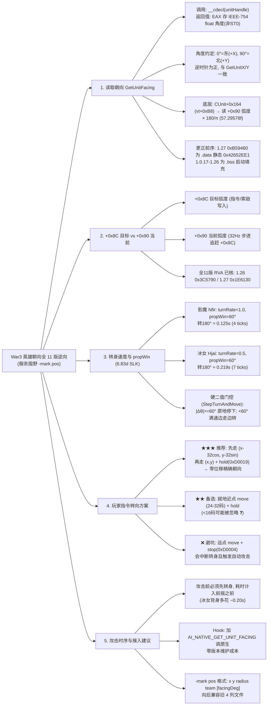

# War3 英雄朝向（读取、转身、转向指令，全 11 版）— 思维导图

```mermaid
flowchart LR
    ROOT["War3 英雄朝向全 11 版逆向<br/>(服务囤野 -mark pos)"]

    ROOT --> R1["1. 读取朝向 GetUnitFacing"]
    R1 --> R1A["调用: __cdecl(unitHandle)<br/>返回值: EAX 存 IEEE-754 float 角度(非ST0)"]
    R1 --> R1B["角度约定: 0°=东(+X), 90°=北(+Y)<br/>逆时针为正, 与 GetUnitX/Y 一致"]
    R1 --> R1C["底层: CUnit+0x164 (vt+0xB8) → 读 +0x90 弧度<br/>× 180/π (57.29578f)"]
    R1 --> R1D["更正前序: 1.27 0xB59460 为 .data 静态 0x42652EE1<br/>1.0.17-1.26 为 .bss 启动填充"]

    ROOT --> R2["2. +0x8C 目标 vs +0x90 当前"]
    R2 --> R2A["+0x8C 目标弧度 (指令/索敌写入)"]
    R2 --> R2B["+0x90 当前弧度 (32Hz 步进追赶 +0x8C)"]
    R2 --> R2C["全11版 RVA 已核: 1.26 0x3C5790 / 1.27 0x1E6130"]

    ROOT --> R3["3. 转身速度与 propWin (6.83d SLK)"]
    R3 --> R3A["影魔 Nfir: turnRate=1.0, propWin=60°<br/>转180° ≈ 0.125s (4 ticks)"]
    R3 --> R3B["冰女 Hjai: turnRate=0.5, propWin=60°<br/>转180° ≈ 0.219s (7 ticks)"]
    R3 --> R3C["硬二值门控 (StepTurnAndMove):<br/>|Δθ|>=60° 原地停下; <60° 满速边走边转"]

    ROOT --> R4["4. 玩家指令转向方案"]
    R4 --> R4A["★★★ 推荐: 先走 (x-32cos, y-32sin)<br/>再走 (x,y) + hold(0xD0019) → 零位移精确朝向"]
    R4 --> R4B["★★ 备选: 就地近点 move (24-32码) + hold<br/>(<16码可能被忽略 ❓)"]
    R4 --> R4C["❌ 避坑: 远点 move + stop(0xD0004)<br/>会中断转身且触发自动攻击"]

    ROOT --> R5["5. 攻击时序与接入建议"]
    R5 --> R5A["攻击前必须先转身, 耗时计入前摇之前<br/>(冰女背身多花 ~0.20s)"]
    R5 --> R5B["Hook: 加 AI_NATIVE_GET_UNIT_FACING 调原生<br/>零版本维护成本"]
    R5 --> R5C["-mark pos 格式: x y radius team [facingDeg]<br/>向后兼容旧 4 列文件"]
```
