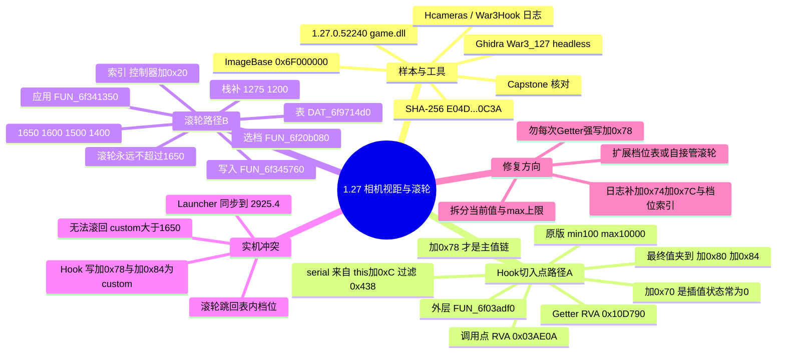

# Warcraft III 1.27 相机视距 / 滚轮思维导图

```mermaid
mindmap
  root((1.27 相机视距与滚轮))
    样本与工具
      1.27.0.52240 game.dll
      SHA-256 E04D...0C3A
      ImageBase 0x6F000000
      Ghidra War3_127 headless
      Capstone 核对
      Hcameras / War3Hook 日志
    Hook切入点路径A
      调用点 RVA 0x03AE0A
      Getter RVA 0x10D790
      外层 FUN_6f03adf0
      serial 来自 this加0xC 过滤 0x438
      最终值夹到 加0x80 加0x84
      原版 min100 max10000
      加0x70 是插值状态常为0
      加0x78 才是主值链
    滚轮路径B
      表 DAT_6f9714d0
      1650 1600 1500 1400
      栈补 1275 1200
      选档 FUN_6f20b080
      应用 FUN_6f341350
      索引 控制器加0x20
      写入 FUN_6f345760
      滚轮永远不超过1650
    实机冲突
      Launcher 同步到 2925.4
      Hook 写加0x78与加0x84为custom
      滚轮跳回表内档位
      无法滚回 custom大于1650
    修复方向
      拆分当前值与max上限
      勿每次Getter强写加0x78
      扩展档位表或自接管滚轮
      日志补加0x74加0x7C与档位索引
```
