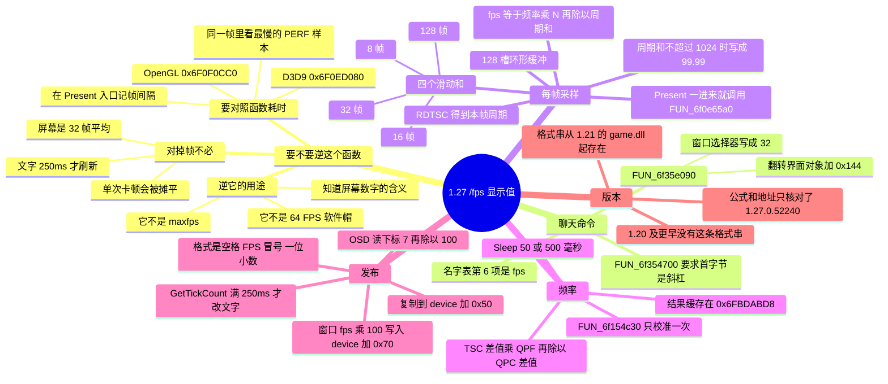

# Warcraft III 1.27：`/fps` 帧率计算思维导图

```mermaid
mindmap
  root((1.27 /fps 显示值))
    要不要逆这个函数
      对掉帧不必
        屏幕是 32 帧平均
        文字 250ms 才刷新
        单次卡顿会被摊平
      要对照函数耗时
        在 Present 入口记帧间隔
        D3D9 0x6F0ED080
        OpenGL 0x6F0F0CC0
        同一帧里看最慢的 PERF 样本
      逆它的用途
        知道屏幕数字的含义
        它不是 maxfps
        它不是 64 FPS 软件帽
    聊天命令
      FUN_6f354700 要求首字节是斜杠
      名字表第 6 项是 fps
      FUN_6f35e090
        窗口选择器写成 32
        翻转界面对象加 0x144
    每帧采样
      Present 一进来就调用 FUN_6f0e65a0
      RDTSC 得到本帧周期
      128 槽环形缓冲
      四个滑动和
        8 帧
        16 帧
        32 帧
        128 帧
      fps 等于频率乘 N 再除以周期和
      周期和不超过 1024 时写成 99.99
    频率
      FUN_6f154c30 只校准一次
      Sleep 50 或 500 毫秒
      TSC 差值乘 QPF 再除以 QPC 差值
      结果缓存在 0x6FBDABD8
    发布
      窗口 fps 乘 100 写入 device 加 0x70
      复制到 device 加 0x50
      OSD 读下标 7 再除以 100
      格式是空格 FPS 冒号 一位小数
      GetTickCount 满 250ms 才改文字
    版本
      公式和地址只核对了 1.27.0.52240
      格式串从 1.21 的 game.dll 起存在
      1.20 及更早没有这条格式串
```
