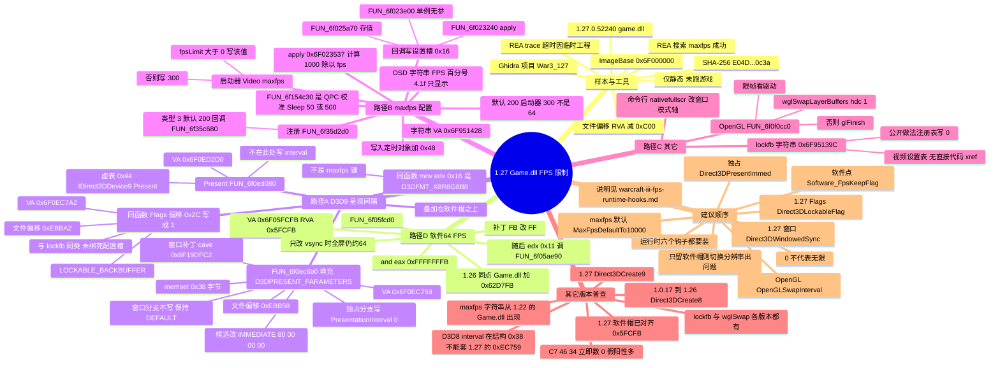

# Warcraft III 1.27 FPS 限制思维导图

```mermaid
mindmap
  root((1.27 Game.dll FPS 限制))
    样本与工具
      1.27.0.52240 game.dll
      SHA-256 E04D...0c3a
      ImageBase 0x6F000000
      文件偏移 RVA 减 0xC00
      REA 搜索 maxfps 成功
      REA trace 超时因临时工程
      Ghidra 项目 War3_127
      仅静态 未跑游戏
    路径D 软件64 FPS
      FUN_6f05fcd0
      and eax 0xFFFFFFFB
      VA 0x6F05FCFB RVA 0x5FCFB
      随后 edx 0x11 调 FUN_6f05ae90
      1.26 同点 Game.dll 加 0x62D7FB
      补丁 FB 改 FF
      只改 vsync 时全屏仍约64
    路径A D3D9 呈现间隔
      叠加在软件帽之上
      FUN_6f0ec6b0 填充 D3DPRESENT_PARAMETERS
        memset 0x38 字节
        独占分支写 PresentationInterval 0
        窗口分支不写 保持 DEFAULT
        VA 0x6F0EC759
        文件偏移 0xEBB59
        窗口补丁 cave 0x6F19DFC2
        候选改 IMMEDIATE 80 00 00 00
      同函数 Flags 偏移 0x2C 写成 1
        LOCKABLE_BACKBUFFER
        VA 0x6F0EC7A2
        文件偏移 0xEBBA2
        与 lockfb 同类 未绑死配置槽
      Present FUN_6f0ed080
        虚表 0x44 IDirect3DDevice9 Present
        VA 0x6F0ED2D0
        不在此处写 interval
      同函数 mov edx 0x16 是 D3DFMT_X8R8G8B8
        不是 maxfps 键
    路径B maxfps 配置
      字符串 VA 0x6F951428
      注册 FUN_6f35d2d0
        类型 3 默认 200 回调 FUN_6f35c680
      回调写设置槽 0x16
        FUN_6f023e00 单例无参
        FUN_6f025a70 存值
        FUN_6f023240 apply
      启动器 Video maxfps
        fpsLimit 大于 0 写该值
        否则写 300
      apply 0x6F023537 计算 1000 除以 fps
      写入定时对象加 0x48
      默认 200 启动器 300 不是 64
      FUN_6f154c30 是 QPC 校准 Sleep 50 或 500
      OSD 字符串 FPS 百分号 4.1f 只显示
    路径C 其它
      lockfb 字符串 0x6F95139C
        视频设置表 无直接代码 xref
        公开做法注册表写 0
      OpenGL FUN_6f0f0cc0
        wglSwapLayerBuffers hdc 1
        否则 glFinish
        限帧看驱动
      命令行 nativefullscr 改窗口模式轴
    其它版本普查
      1.0.17 到 1.26 Direct3DCreate8
      1.27 Direct3DCreate9
      maxfps 字符串从 1.22 的 Game.dll 出现
      lockfb 与 wglSwap 各版本都有
      1.27 软件帽已对齐 0x5FCFB
      D3D8 interval 在结构 0x38 不能套 1.27 的 0xEC759
      C7 46 34 立即数 0 假阳性多
    建议顺序
      运行时六个钩子都要装
      只留软件帽则切换分辨率出问题
      说明见 warcraft-iii-fps-runtime-hooks.md
      软件点 Software_FpsKeepFlag
      独占 Direct3DPresentImmed
      1.27 窗口 Direct3DWindowedSync
      1.27 Flags Direct3DLockableFlag
      OpenGL OpenGLSwapInterval
      maxfps 默认 MaxFpsDefaultTo10000
      0 不代表无限
```
