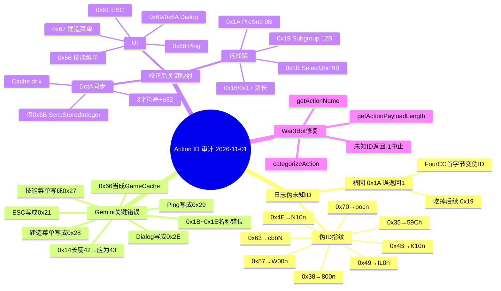
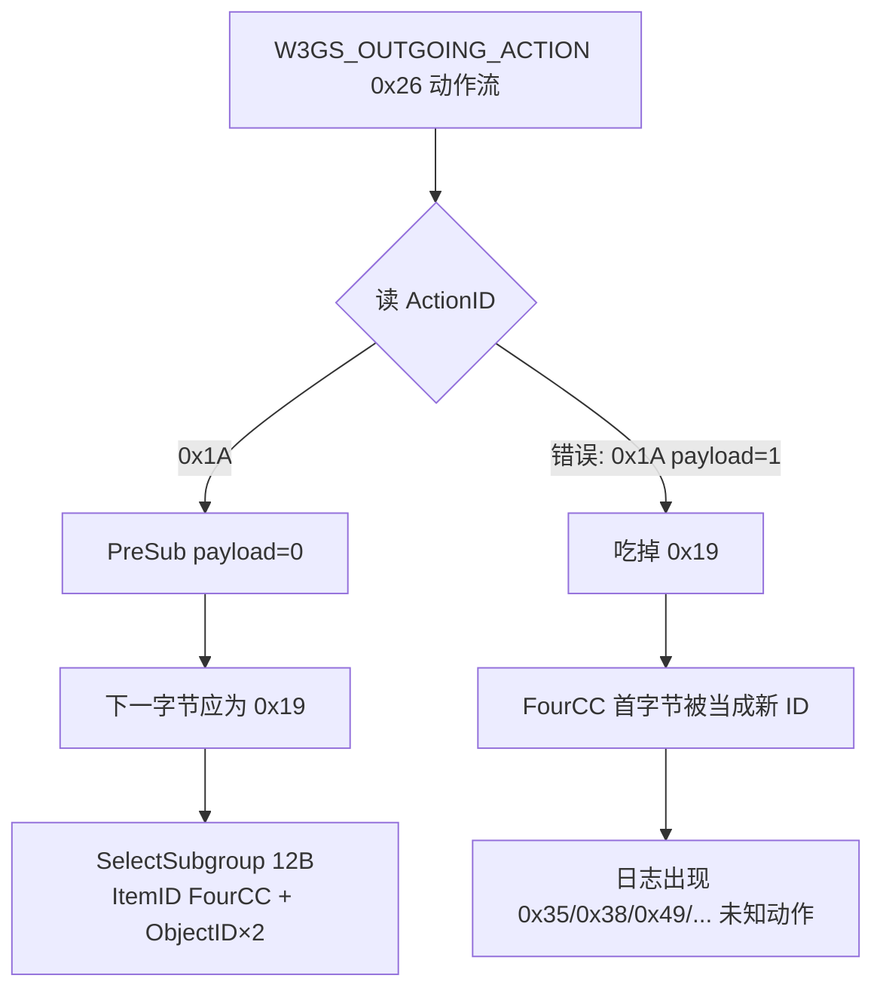

# 魔兽争霸 III Action 载荷长度审计 — 思维导图

详见正文：[`warcraft-iii-action-ids-payload-length-audit.md`](./warcraft-iii-action-ids-payload-length-audit.md)

```mermaid
mindmap
  root((Action ID 审计 2026-11-01))
    日志伪未知ID
      根因 0x1A 误返回1
        吃掉后续 0x19
        FourCC首字节变伪ID
      伪ID指纹
        0x35→59Ch
        0x38→800n
        0x49→IL0n
        0x4B→K10n
        0x4E→N10n
        0x57→W00n
        0x63→cbbN
        0x70→pocn
    Gemini关键错误
      0x66当成GameCache
      ESC写成0x21
      技能菜单写成0x27
      建造菜单写成0x28
      Ping写成0x29
      Dialog写成0x2E
      0x14长度42→应为43
      0x1B~0x1E名称错位
    校正后关键映射
      UI
        0x61 ESC
        0x66 技能菜单
        0x67 建造菜单
        0x68 Ping
        0x69/0x6A Dialog
      选择链
        0x1A PreSub 0B
        0x19 Subgroup 12B
        0x1B SelectUnit 9B
        0x16/0x17 变长
      DotA同步
        仅0x6B SyncStoredInteger
        3字符串+u32
        Cache dr.x
    War3Bot修复
      getActionPayloadLength
      categorizeAction
      getActionName
      未知ID返回-1中止
```

```mermaid
flowchart TD
    A[W3GS_OUTGOING_ACTION 0x26 动作流] --> B{读 ActionID}
    B -->|0x1A| C[PreSub payload=0]
    C --> D[下一字节应为 0x19]
    D --> E[SelectSubgroup 12B<br/>ItemID FourCC + ObjectID×2]
    B -->|错误: 0x1A payload=1| F[吃掉 0x19]
    F --> G[FourCC 首字节被当成新 ID]
    G --> H[日志出现 0x35/0x38/0x49/... 未知动作]
```
