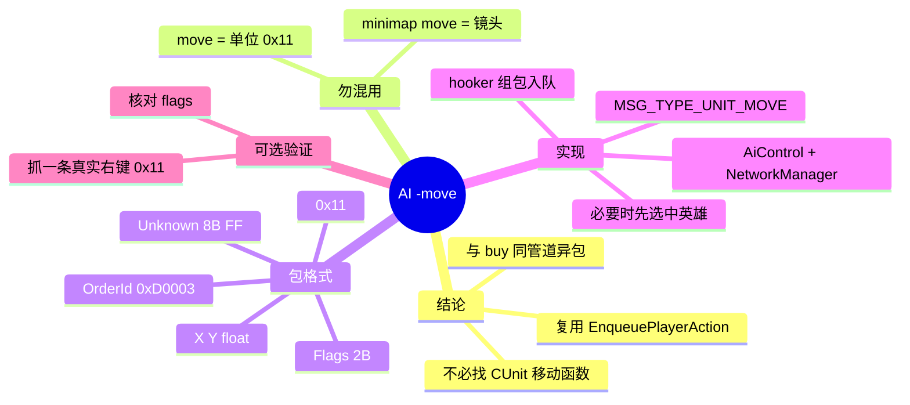

# AI 英雄移动命令 — 思维导图

```mermaid
mindmap
  root((AI -move))
    结论
      复用 EnqueuePlayerAction
      不必找 CUnit 移动函数
      与 buy 同管道异包
    勿混用
      minimap move = 镜头
      move = 单位 0x11
    包格式
      0x11
      Flags 2B
      OrderId 0xD0003
      Unknown 8B FF
      X Y float
    实现
      MSG_TYPE_UNIT_MOVE
      AiControl + NetworkManager
      hooker 组包入队
      必要时先选中英雄
    可选验证
      抓一条真实右键 0x11
      核对 flags
```

配套正文：[`warcraft-iii-ai-hero-move-command.md`](./warcraft-iii-ai-hero-move-command.md)
