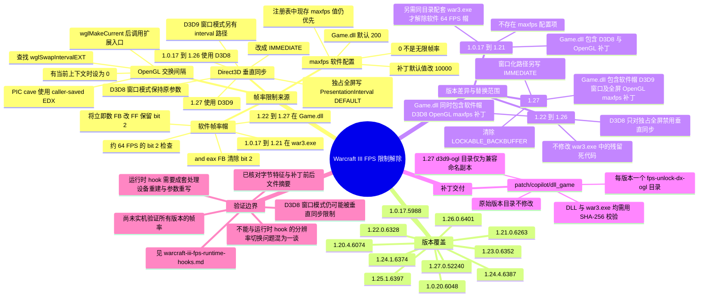

# Warcraft III 全版本 FPS 限制与补丁思维导图

```mermaid
mindmap
  root((Warcraft III FPS 限制解除))
    帧率限制来源
      软件帧率帽
        约 64 FPS 的 bit 2 检查
        and eax FB 清除 bit 2
        将立即数 FB 改 FF 保留 bit 2
        1.0.17 到 1.21 在 war3.exe
        1.22 到 1.27 在 Game.dll
      Direct3D 垂直同步
        1.0.17 到 1.26 使用 D3D8
        1.27 使用 D3D9
        独占全屏写 PresentationInterval DEFAULT
        改成 IMMEDIATE
        D3D8 窗口模式保持原参数
        D3D9 窗口模式另有 interval 路径
      OpenGL 交换间隔
        wglMakeCurrent 后调用扩展入口
        查找 wglSwapIntervalEXT
        有当前上下文时设为 0
        PIC cave 使用 caller-saved EDX
      maxfps 软件配置
        Game.dll 默认 200
        补丁默认值改 10000
        注册表中现存 maxfps 值仍优先
        0 不是无限帧率
    版本覆盖
      1.0.17.5988
      1.0.20.6048
      1.20.4.6074
      1.21.0.6263
      1.22.0.6328
      1.23.0.6352
      1.24.1.6374
      1.24.4.6387
      1.25.1.6397
      1.26.0.6401
      1.27.0.52240
    版本差异与替换范围
      1.0.17 到 1.21
        Game.dll 包含 D3D8 与 OpenGL 补丁
        另需同目录配套 war3.exe 才解除软件 64 FPS 帽
        不存在 maxfps 配置项
      1.22 到 1.26
        Game.dll 同时包含软件帽 D3D8 OpenGL maxfps 补丁
        不修改 war3.exe 中的残留死代码
        D3D8 只对独占全屏禁用垂直同步
      1.27
        Game.dll 包含软件帽 D3D9 窗口及全屏 OpenGL maxfps 补丁
        窗口化路径另写 IMMEDIATE
        清除 LOCKABLE_BACKBUFFER
    补丁交付
      patch/copilot/dll_game
        每版本一个 fps-unlock-dx-ogl 目录
        原始版本目录不修改
        1.27 d3d9-ogl 目录仅为兼容命名副本
        DLL 与 war3.exe 均需用 SHA-256 校验
    验证边界
      已核对字节特征与补丁前后文件摘要
      尚未实机验证所有版本的帧率
      D3D8 窗口模式仍可能被垂直同步限制
      不能与运行时 hook 的分辨率切换问题混为一谈
      运行时 hook 需要成套处理设备重建与参数重写
      见 warcraft-iii-fps-runtime-hooks.md
```
