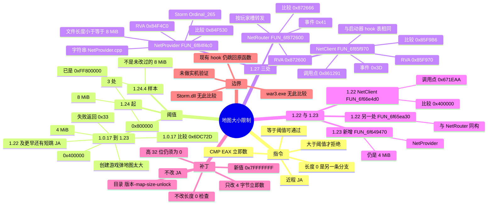

# Warcraft III 地图大小限制思维导图

```mermaid
mindmap
  root((地图大小限制))
    指令
      CMP EAX 立即数
      近程 JA
      大于阈值才拒绝
      等于阈值可通过
      长度 0 是另一条分支
    阈值
      1.0.17 到 1.23
        0x400000
        4 MiB
        1.22 及更早还有短跳 JA
        创建游戏弹地图太大
        1.0.17 比较 0x6DC72D
        失败返回 0x33
      1.24 起
        0x800000
        8 MiB
        3 处
      1.24.4 样本
        已是 0xFF800000
        不是未改过的 8 MiB
    1.27 三处
      NetProvider FUN_6f84f4c0
        RVA 0x84F4C0
        比较 0x84F530
        Storm Ordinal_265
        文件长度小于等于 8 MiB
        字符串 NetProvider.cpp
      NetClient FUN_6f85f970
        RVA 0x85F970
        比较 0x85F9B6
        事件 0x3D
        调用点 0x861291
        与启动器 hook 表相同
      NetRouter FUN_6f872600
        RVA 0x872600
        比较 0x872666
        事件 0x41
        按玩家槽转发
    1.22 与 1.23
      1.22 NetClient FUN_6f66e4d0
        比较 0x400000
        调用点 0x671EAA
      1.22 另一处 FUN_6f65ea30
        与 NetRouter 同构
      1.23 新增 FUN_6f649470
        NetProvider
        仍是 4 MiB
    补丁
      只改 4 字节立即数
      新值 0x7FFFFFFF
      目录 版本-map-size-unlock
      不改 JA
      不改长度 0 检查
      高 32 位仍须为 0
    边界
      war3.exe 无此比较
      Storm.dll 无此比较
      现有 hook 仍跳回原函数
      未做实机验证
```
