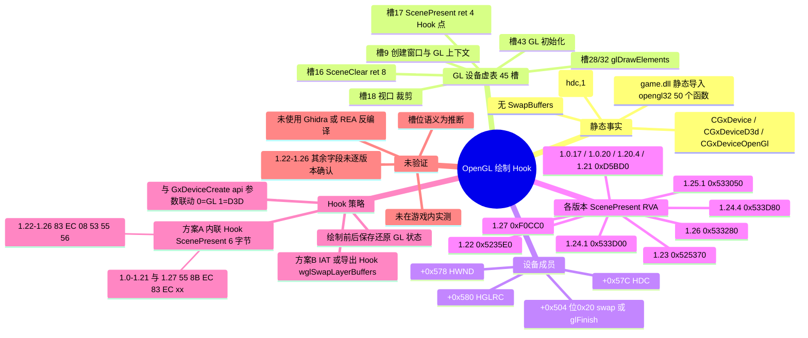

# Warcraft III 全版本 OpenGL 绘制偏移思维导图

对应报告：[warcraft-iii-all-versions-opengl-draw-offsets.md](warcraft-iii-all-versions-opengl-draw-offsets.md)（静态分析，未运行验证）

```mermaid
mindmap
  root((OpenGL 绘制 Hook))
    静态事实
      game.dll 静态导入 opengl32 50 个函数
      无 SwapBuffers
      交换缓冲 wglSwapLayerBuffers(hdc,1)
      CGxDevice / CGxDeviceD3d / CGxDeviceOpenGl
    GL 设备虚表 45 槽
      槽16 SceneClear ret 8
      槽17 ScenePresent ret 4 Hook 点
      槽9 创建窗口与 GL 上下文
      槽18 视口 裁剪
      槽28/32 glDrawElements
      槽43 GL 初始化
    设备成员
      +0x578 HWND
      +0x57C HDC
      +0x580 HGLRC
      +0x504 位0x20 swap 或 glFinish
    各版本 ScenePresent RVA
      1.0.17 / 1.0.20 / 1.20.4 / 1.21 0xD5BD0
      1.22 0x5235E0
      1.23 0x525370
      1.24.1 0x533D00
      1.24.4 0x533D80
      1.25.1 0x533050
      1.26 0x533280
      1.27 0xF0CC0
    Hook 策略
      方案A 内联 Hook ScenePresent 6 字节
        1.0-1.21 与 1.27 55 8B EC 83 EC xx
        1.22-1.26 83 EC 08 53 55 56
      方案B IAT 或导出 Hook wglSwapLayerBuffers
      绘制前后保存还原 GL 状态
      与 GxDeviceCreate api 参数联动 0=GL 1=D3D
    未验证
      未在游戏内实测
      槽位语义为推断
      1.22-1.26 其余字段未逐版本确认
      未使用 Ghidra 或 REA 反编译
```
