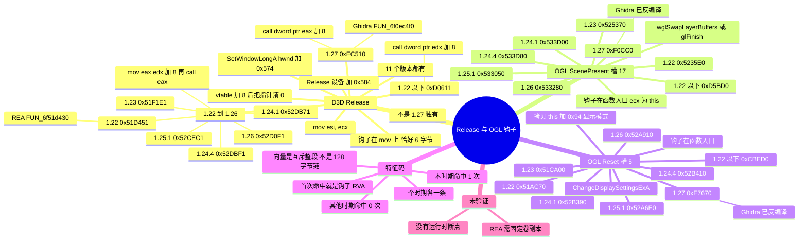

# Warcraft III Release 与 OpenGL 钩子思维导图

对应报告：[warcraft-iii-all-versions-release-and-ogl-hooks.md](warcraft-iii-all-versions-release-and-ogl-hooks.md)

```mermaid
mindmap
  root((Release 与 OGL 钩子))
    D3D Release
      11 个版本都有
      不是 1.27 独有
      mov esi, ecx
      SetWindowLongA hwnd 加 0x574
      Release 设备 加 0x584
      vtable 加 8 后把指针清 0
      钩子在 mov 上 恰好 6 字节
      1.22 以下 0xD0611
        call dword ptr edx 加 8
      1.22 到 1.26
        1.22 0x51D451
          REA FUN_6f51d430
        1.23 0x51F1E1
        1.24.1 0x52DB71
        1.24.4 0x52DBF1
        1.25.1 0x52CEC1
        1.26 0x52D0F1
        mov eax edx 加 8 再 call eax
      1.27 0xEC510
        Ghidra FUN_6f0ec4f0
        call dword ptr eax 加 8
    OGL ScenePresent 槽 17
      wglSwapLayerBuffers 或 glFinish
      钩子在函数入口 ecx 为 this
      1.22 以下 0xD5BD0
      1.22 0x5235E0
      1.23 0x525370
      1.24.1 0x533D00
      1.24.4 0x533D80
      1.25.1 0x533050
      1.26 0x533280
      1.27 0xF0CC0
        Ghidra 已反编译
    OGL Reset 槽 5
      ChangeDisplaySettingsExA
      拷贝 this 加 0x94 显示模式
      钩子在函数入口
      1.22 以下 0xCBED0
      1.22 0x51AC70
      1.23 0x51CA00
      1.24.1 0x52B390
      1.24.4 0x52B410
      1.25.1 0x52A6E0
      1.26 0x52A910
      1.27 0xE7670
        Ghidra 已反编译
    特征码
      三个时期各一条
      本时期命中 1 次
      其他时期命中 0 次
      首次命中就是钩子 RVA
      向量是互斥整段 不是 128 字节链
    未验证
      没有运行时断点
      REA 需固定卷副本
```
