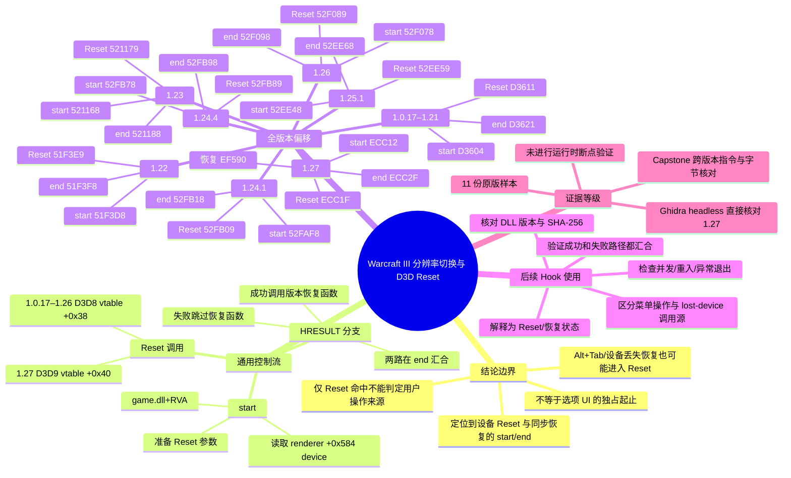

# Warcraft III 各版本 Reset 边界思维导图

```mermaid
mindmap
  root((Warcraft III 分辨率切换与 D3D Reset))
    结论边界
      定位到设备 Reset 与同步恢复的 start/end
      不等于选项 UI 的独占起止
      Alt+Tab/设备丢失恢复也可能进入 Reset
      仅 Reset 命中不能判定用户操作来源
    通用控制流
      start
        game.dll+RVA
        读取 renderer +0x584 device
        准备 Reset 参数
      Reset 调用
        1.0.17–1.26 D3D8 vtable +0x38
        1.27 D3D9 vtable +0x40
      HRESULT 分支
        成功调用版本恢复函数
        失败跳过恢复函数
        两路在 end 汇合
    全版本偏移
      1.0.17–1.21
        start D3604
        Reset D3611
        end D3621
      1.22
        start 51F3D8
        Reset 51F3E9
        end 51F3F8
      1.23
        start 521168
        Reset 521179
        end 521188
      1.24.1
        start 52FAF8
        Reset 52FB09
        end 52FB18
      1.24.4
        start 52FB78
        Reset 52FB89
        end 52FB98
      1.25.1
        start 52EE48
        Reset 52EE59
        end 52EE68
      1.26
        start 52F078
        Reset 52F089
        end 52F098
      1.27
        start ECC12
        Reset ECC1F
        恢复 EF590
        end ECC2F
    后续 Hook 使用
      解释为 Reset/恢复状态
      核对 DLL 版本与 SHA-256
      验证成功和失败路径都汇合
      检查并发/重入/异常退出
      区分菜单操作与 lost-device 调用源
    证据等级
      11 份原版样本
      Capstone 跨版本指令与字节核对
      Ghidra headless 直接核对 1.27
      未进行运行时断点验证
```
