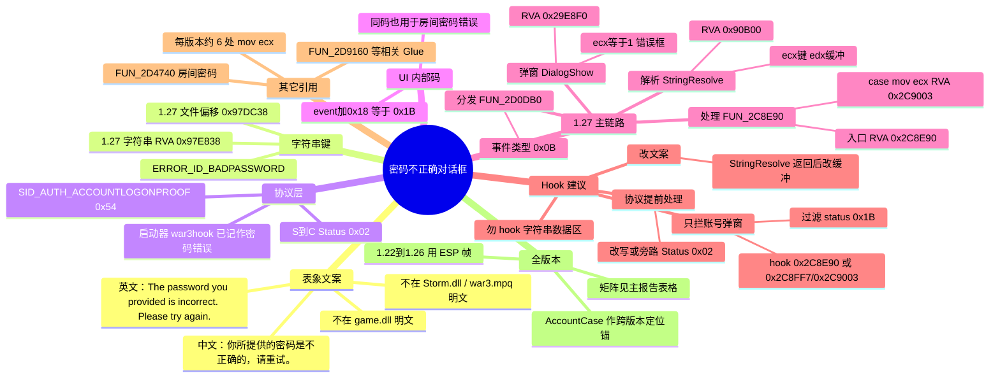

# Warcraft III：战网「密码不正确」对话框思维导图

```mermaid
mindmap
  root((密码不正确对话框))
    表象文案
      中文：你所提供的密码是不正确的，请重试。
      英文：The password you provided is incorrect. Please try again.
      不在 game.dll 明文
      不在 Storm.dll / war3.mpq 明文
    字符串键
      ERROR_ID_BADPASSWORD
      1.27 字符串 RVA 0x97E838
      1.27 文件偏移 0x97DC38
    协议层
      SID_AUTH_ACCOUNTLOGONPROOF 0x54
      S到C Status 0x02
      启动器 war3hook 已记作密码错误
    UI 内部码
      event加0x18 等于 0x1B
      同码也用于房间密码错误
    1.27 主链路
      分发 FUN_2D0DB0
        事件类型 0x0B
      处理 FUN_2C8E90
        入口 RVA 0x2C8E90
        case mov ecx RVA 0x2C9003
      解析 StringResolve
        RVA 0x90B00
        ecx键 edx缓冲
      弹窗 DialogShow
        RVA 0x29E8F0
        ecx等于1 错误框
    Hook 建议
      只拦账号弹窗
        hook 0x2C8E90 或 0x2C8FF7/0x2C9003
        过滤 status 0x1B
      改文案
        StringResolve 返回后改缓冲
      协议提前处理
        改写或旁路 Status 0x02
      勿 hook 字符串数据区
    其它引用
      FUN_2D4740 房间密码
      FUN_2D9160 等相关 Glue
      每版本约 6 处 mov ecx
    全版本
      AccountCase 作跨版本定位锚
      1.22到1.26 用 ESP 帧
      矩阵见主报告表格
```
