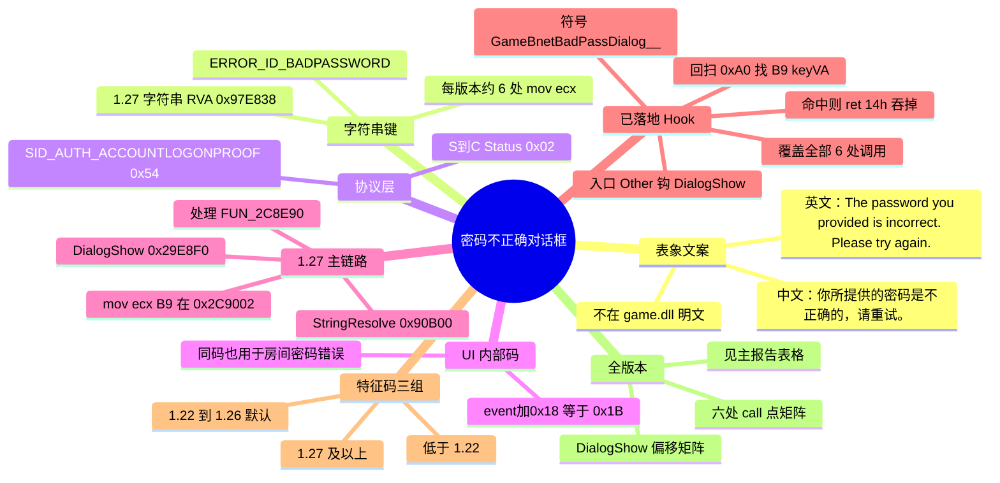

# Warcraft III：战网「密码不正确」对话框思维导图

| 项 | 值 |
| --- | --- |
| 分析模型 | Composer |
| 分析目的 | 配套主报告，梳理弹窗链路与 Hook |
| 命名方式 | `GameBnetBadPassDialog__` |
| 分析时间 | 2026-11-17 |

```mermaid
mindmap
  root((密码不正确对话框))
    表象文案
      中文：你所提供的密码是不正确的，请重试。
      英文：The password you provided is incorrect. Please try again.
      不在 game.dll 明文
    字符串键
      ERROR_ID_BADPASSWORD
      每版本约 6 处 mov ecx
      1.27 字符串 RVA 0x97E838
    协议层
      SID_AUTH_ACCOUNTLOGONPROOF 0x54
      S到C Status 0x02
    UI 内部码
      event加0x18 等于 0x1B
      同码也用于房间密码错误
    1.27 主链路
      处理 FUN_2C8E90
      mov ecx B9 在 0x2C9002
      StringResolve 0x90B00
      DialogShow 0x29E8F0
    已落地 Hook
      符号 GameBnetBadPassDialog__
      入口 Other 钩 DialogShow
      回扫 0xA0 找 B9 keyVA
      命中则 ret 14h 吞掉
      覆盖全部 6 处调用
    特征码三组
      低于 1.22
      1.22 到 1.26 默认
      1.27 及以上
    全版本
      DialogShow 偏移矩阵
      六处 call 点矩阵
      见主报告表格
```
