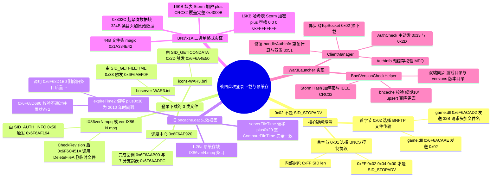

# Warcraft III：战网首次登录 BNFTP (`0x02`) 下载与 `bncache.dat` 预下载思维导图

```mermaid
mindmap
  root((战网首次登录下载与预缓存))
    核心疑问澄清
      0x02 不是 SID_STOPADV
      首字节 0x01 选择 BNCS 控制协议
        内部封包 0xFF SID len
        0xFF 0x02 0x04 0x00 才是 SID_STOPADV
      首字节 0x02 选择 BNFTP 文件传输
        game.dll 0x6F6ACAAE 发送 0x02
        game.dll 0x6F6ACAD2 发送 32B 请求头加文件名
    登录下载的 3 类文件
      调度中心 0x6F6AE920
        完成回调 0x6F6AAB00 与 7 分支跳表 0x6F6AADEC
      IX86verN.mpq 或 ver-IX86-N.mpq
        由 SID_AUTH_INFO 0x50 触发 0x6F6AF194
        CheckRevision 后 0x6F6C451A 调用 DeleteFileA 删临时文件
      bnserver-WAR3.ini
        由 SID_GETFILETIME 0x33 触发 0x6F6AEF0F
      icons-WAR3.bni
        由 SID_GETICONDATA 0x2D 触发 0x6F6A4E50
    旧 bncache.dat 失效根因
      expireTime2 偏移 plus0x38 为 2010 年时间戳
        0x6F68D690 校验不通过并置状态 2
        调用 0x6F68D1B0 删除旧条目后重下
      serverFileTime 偏移 plus0x20 需 CompareFileTime 完全一致
      1.26a 原缓存缺 IX86verN.mpq 条目
    BN3\x1A 二进制格式实证
      44B 文件头 magic 0x1A334E42
      16KB 哈希表 Storm 加密 plus 空槽 0 0 0 0xFFFFFFFF
      16KB 块表 Storm 加密 plus CRC32 覆盖完整 0x4000B
      0x802C 起紧凑数据块 324B 条目头加原始数据
    War3Launcher 实现
      BnetVersionCheckHelper
        Storm Hash 加解密与 IEEE CRC32
        bncache 校验 续期10年 upsert 克隆兜底
        双端同步 游戏目录与 versions 版本目录
      ClientManager
        修复 handleAuthInfo 重复计算与双发 0x51
        AuthInfo 预缓存校验 MPQ
        AuthCheck 主动发 0x33 与 0x2D
        异步 QTcpSocket 0x02 预下载
```

