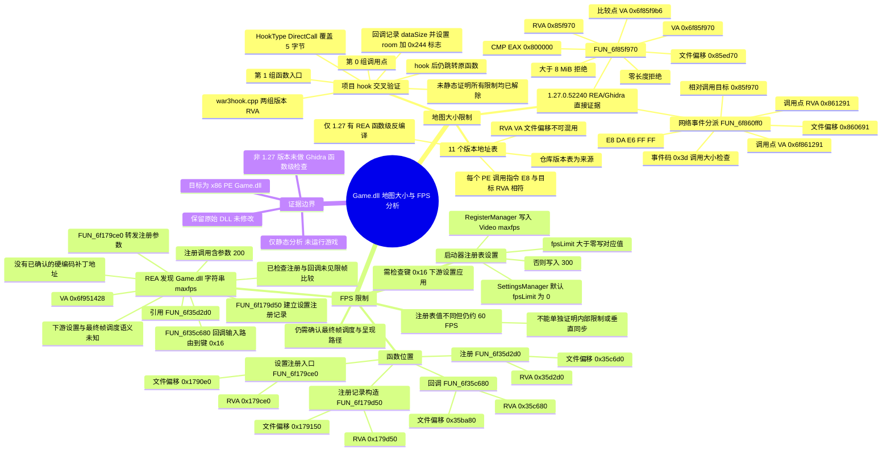

# Warcraft III Game.dll 限制分析思维导图

```mermaid
mindmap
  root((Game.dll 地图大小与 FPS 分析))
    地图大小限制
      1.27.0.52240 REA/Ghidra 直接证据
        FUN_6f85f970
          VA 0x6f85f970
          RVA 0x85f970
          文件偏移 0x85ed70
          比较点 VA 0x6f85f9b6
          CMP EAX 0x800000
          大于 8 MiB 拒绝
          零长度拒绝
        网络事件分派 FUN_6f860ff0
          事件码 0x3d 调用大小检查
          调用点 VA 0x6f861291
          调用点 RVA 0x861291
          文件偏移 0x860691
          E8 DA E6 FF FF
          相对调用目标 0x85f970
      项目 hook 交叉验证
        war3hook.cpp 两组版本 RVA
        第 0 组调用点
        第 1 组函数入口
        HookType DirectCall 覆盖 5 字节
        回调记录 dataSize 并设置 room 加 0x244 标志
        hook 后仍跳转原函数
        未静态证明所有限制均已解除
      11 个版本地址表
        仓库版本表为来源
        每个 PE 调用指令 E8 与目标 RVA 相符
        仅 1.27 有 REA 函数级反编译
        RVA VA 文件偏移不可混用
    FPS 限制
      REA 发现 Game.dll 字符串 maxfps
        VA 0x6f951428
        引用 FUN_6f35d2d0
        注册调用含参数 200
        FUN_6f179ce0 转发注册参数
        FUN_6f179d50 建立设置注册记录
        FUN_6f35c680 回调输入路由到键 0x16
        下游设置与最终帧调度语义未知
        已检查注册与回调未见限帧比较
        没有已确认的硬编码补丁地址
      函数位置
        注册 FUN_6f35d2d0
          RVA 0x35d2d0
          文件偏移 0x35c6d0
        回调 FUN_6f35c680
          RVA 0x35c680
          文件偏移 0x35ba80
        设置注册入口 FUN_6f179ce0
          RVA 0x179ce0
          文件偏移 0x1790e0
        注册记录构造 FUN_6f179d50
          RVA 0x179d50
          文件偏移 0x179150
      启动器注册表设置
        RegisterManager 写入 Video maxfps
        fpsLimit 大于零写对应值
        否则写入 300
        SettingsManager 默认 fpsLimit 为 0
      注册表值不同但仍约 60 FPS
        不能单独证明内部限制或垂直同步
      需检查键 0x16 下游设置应用
      仍需确认最终帧调度与呈现路径
    证据边界
      目标为 x86 PE Game.dll
      仅静态分析 未运行游戏
      保留原始 DLL 未修改
      非 1.27 版本未做 Ghidra 函数级检查
```
