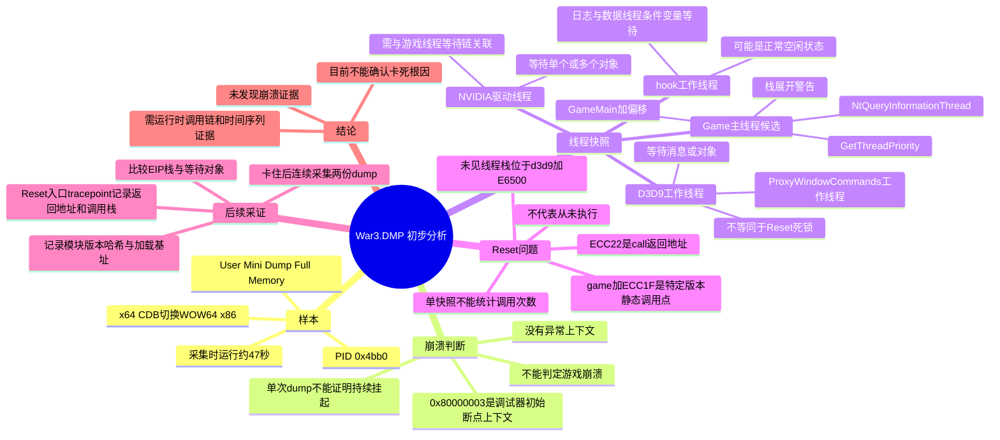

# Warcraft III 挂起 Dump 初步分析思维导图

```mermaid
mindmap
  root((War3.DMP 初步分析))
    样本
      User Mini Dump Full Memory
      PID 0x4bb0
      采集时运行约47秒
      x64 CDB切换WOW64 x86
    崩溃判断
      没有异常上下文
      0x80000003是调试器初始断点上下文
      不能判定游戏崩溃
      单次dump不能证明持续挂起
    线程快照
      Game主线程候选
        NtQueryInformationThread
        GetThreadPriority
        GameMain加偏移
        栈展开警告
      D3D9工作线程
        ProxyWindowCommands工作线程
        等待消息或对象
        不等同于Reset死锁
      NVIDIA驱动线程
        等待单个或多个对象
        需与游戏线程等待链关联
      hook工作线程
        日志与数据线程条件变量等待
        可能是正常空闲状态
    Reset问题
      未见线程栈位于d3d9加E6500
      不代表从未执行
      单快照不能统计调用次数
      game加ECC1F是特定版本静态调用点
      ECC22是call返回地址
    后续采证
      卡住后连续采集两份dump
      比较EIP栈与等待对象
      Reset入口tracepoint记录返回地址和调用栈
      记录模块版本哈希与加载基址
    结论
      未发现崩溃证据
      目前不能确认卡死根因
      需运行时调用链和时间序列证据
```
