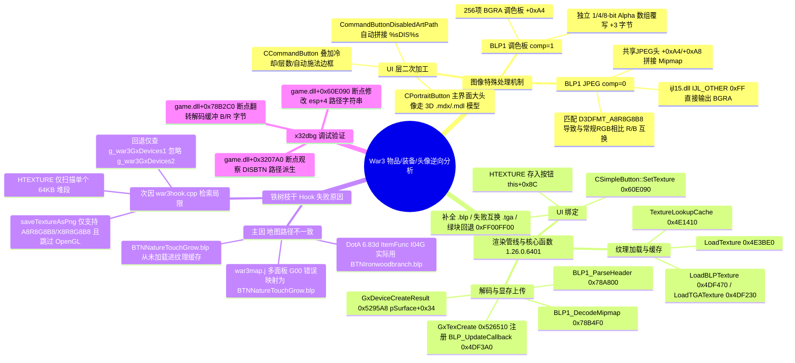

# 魔兽争霸 III 商店物品、英雄装备与头像图像处理逆向导图

```mermaid
mindmap
  root((War3 物品/装备/头像逆向分析))
    图像特殊处理机制
      BLP1 JPEG comp=0
        共享JPEG头 +0xA4/+0xA8 拼接 Mipmap
        ijl15.dll IJL_OTHER 0xFF 直接输出 BGRA
        匹配 D3DFMT_A8R8G8B8 导致与常规RGB相比 R/B 互换
      BLP1 调色板 comp=1
        256项 BGRA 调色板 +0xA4
        独立 1/4/8-bit Alpha 数组覆写 +3 字节
      UI 层二次加工
        CommandButtonDisabledArtPath 自动拼接 %sDIS%s
        CCommandButton 叠加冷却/层数/自动施法边框
        CPortraitButton 主界面大头像走 3D .mdx/.mdl 模型
    渲染管线与核心函数 1.26.0.6401
      UI 绑定
        CSimpleButton::SetTexture 0x60E090
        补全 .blp / 失败互换 .tga / 绿块回退 0xFF00FF00
        HTEXTURE 存入按钮 this+0x8C
      纹理加载与缓存
        LoadTexture 0x4E3BE0
        TextureLookupCache 0x4E1410
        LoadBLPTexture 0x4DF470 / LoadTGATexture 0x4DF230
      解码与显存上传
        BLP1_ParseHeader 0x78A800
        GxTexCreate 0x526510 注册 BLP_UpdateCallback 0x4DF3A0
        BLP1_DecodeMipmap 0x78B4F0
        GxDeviceCreateResult 0x5295A8 pSurface+0x34
    铁树枝干 Hook 失败原因
      主因 地图路径不一致
        DotA 6.83d ItemFunc I04G 实际用 BTNIronwoodbranch.blp
        war3map.j 多面板 G00 错误映射为 BTNNatureTouchGrow.blp
        BTNNatureTouchGrow.blp 从未加载进纹理缓存
      次因 war3hook.cpp 检索局限
        HTEXTURE 仅扫描单个 64KB 堆段
        回退仅查 g_war3GxDevices1 忽略 g_war3GxDevices2
        saveTextureAsPng 仅支持 A8R8G8B8/X8R8G8B8 且跳过 OpenGL
    x32dbg 调试验证
      game.dll+0x60E090 断点修改 esp+4 路径字符串
      game.dll+0x3207A0 断点观察 DISBTN 路径派生
      game.dll+0x78B2C0 断点翻转解码缓冲 B/R 字节
```

