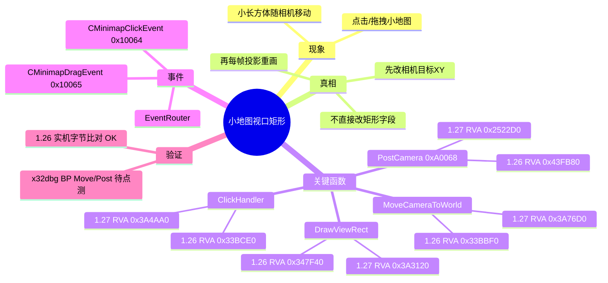

# 小地图视口小长方体移动 — 思维导图

```mermaid
mindmap
  root((小地图视口矩形))
    现象
      点击/拖拽小地图
      小长方体随相机移动
    真相
      不直接改矩形字段
      先改相机目标XY
      再每帧投影重画
    关键函数
      MoveCameraToWorld
        1.27 RVA 0x3A76D0
        1.26 RVA 0x33BBF0
      PostCamera 0xA0068
        1.27 RVA 0x2522D0
        1.26 RVA 0x43FB80
      ClickHandler
        1.27 RVA 0x3A4AA0
        1.26 RVA 0x33BCE0
      DrawViewRect
        1.27 RVA 0x3A3120
        1.26 RVA 0x347F40
    事件
      CMinimapClickEvent 0x10064
      CMinimapDragEvent 0x10065
      EventRouter
    验证
      1.26 实机字节比对 OK
      x32dbg BP Move/Post 待点测
```

## 一句话

**移动框 = `CMinimap_MoveCameraToWorld`；画框 = `CMinimap_DrawViewRect`。**
