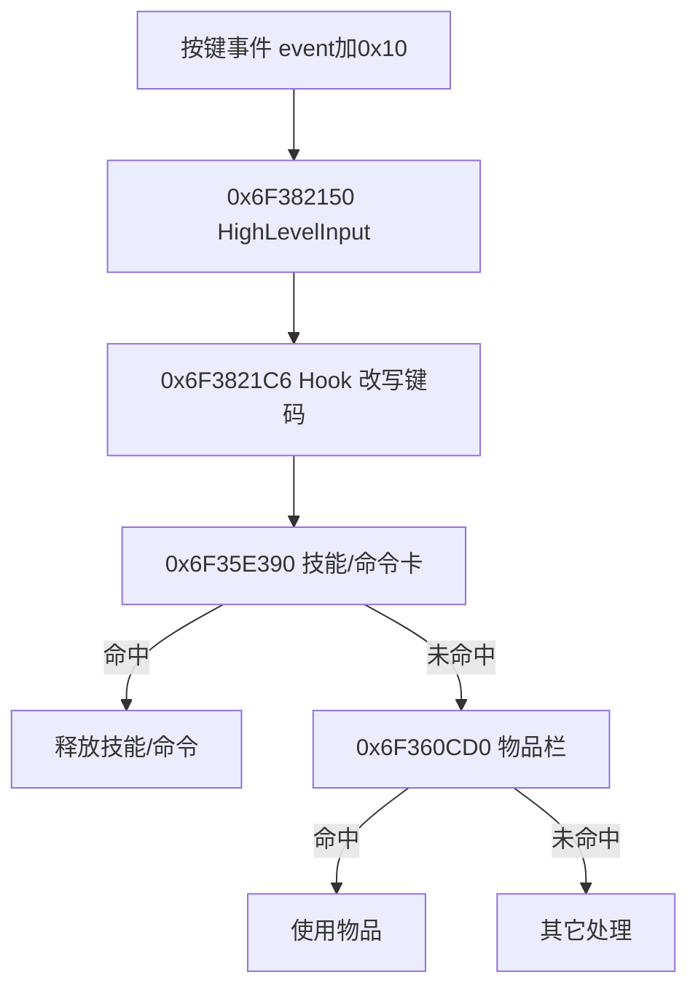
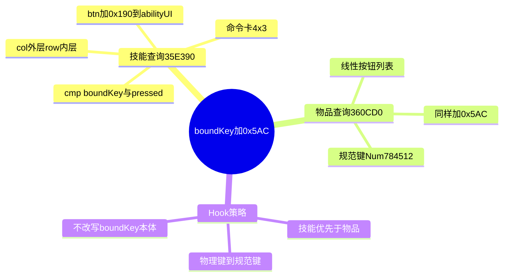
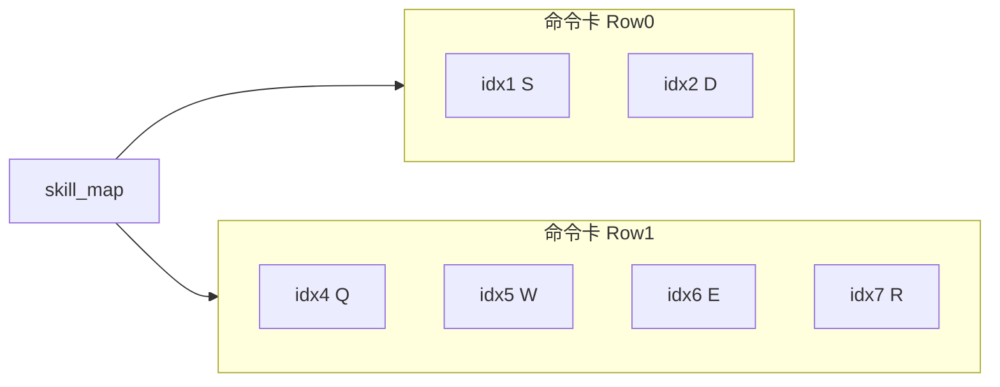
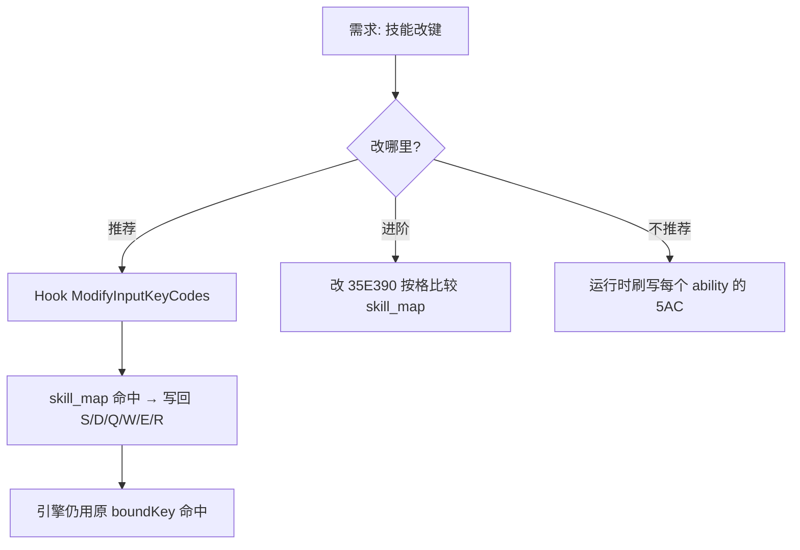

# Warcraft III 技能改键 — 思维导图

详细论证见：[`warcraft-iii-skill-key-remap.md`](./warcraft-iii-skill-key-remap.md)

---

## 一、输入分发

```mermaid
flowchart TD
  K[按键事件 event加0x10] --> H[0x6F382150 HighLevelInput]
  H --> Hook["0x6F3821C6 Hook 改写键码"]
  Hook --> S["0x6F35E390 技能/命令卡"]
  S -->|命中| Cast[释放技能/命令]
  S -->|未命中| I["0x6F360CD0 物品栏"]
  I -->|命中| Use[使用物品]
  I -->|未命中| Other[其它处理]
```

---

## 二、匹配机制

```mermaid
mindmap
  root((boundKey加0x5AC))
    技能查询35E390
      命令卡4x3
      col外层row内层
      btn加0x190到abilityUI
      cmp boundKey与pressed
    物品查询360CD0
      线性按钮列表
      同样加0x5AC
      规范键Num784512
    Hook策略
      物理键到规范键
      技能优先于物品
      不改写boundKey本体
```

---

## 三、Launcher 槽位

```mermaid
flowchart LR
  subgraph Row0["命令卡 Row0"]
    S1["idx1 S"]
    S2["idx2 D"]
  end
  subgraph Row1["命令卡 Row1"]
    Q["idx4 Q"]
    W["idx5 W"]
    E["idx6 E"]
    R["idx7 R"]
  end
  skill_map --> Row0
  skill_map --> Row1
```

---

## 四、实现选择

```mermaid
flowchart TD
  A[需求: 技能改键] --> B{改哪里?}
  B -->|推荐| C[Hook ModifyInputKeyCodes]
  C --> D["skill_map 命中 → 写回 S/D/Q/W/E/R"]
  D --> E[引擎仍用原 boundKey 命中]
  B -->|进阶| F[改 35E390 按格比较 skill_map]
  B -->|不推荐| G[运行时刷写每个 ability 的 5AC]
```
