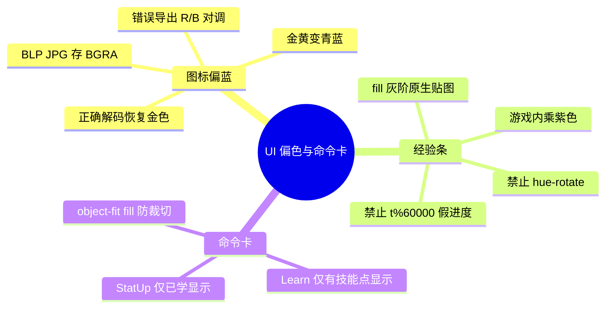

# WC3 UI 图标/经验条/命令卡 · 脑图

```mermaid
mindmap
  root((UI 偏色与命令卡))
    图标偏蓝
      BLP JPG 存 BGRA
      错误导出 R/B 对调
      金黄变青蓝
      正确解码恢复金色
    经验条
      fill 灰阶原生贴图
      游戏内乘紫色
      禁止 hue-rotate
      禁止 t%60000 假进度
    命令卡
      StatUp 仅已学显示
      Learn 仅有技能点显示
      object-fit fill 防裁切
```
